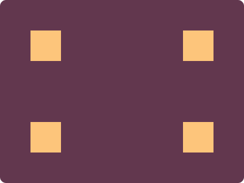

## CSS Battle #2 - Carrom

  
[see the daily target](https://cssbattle.dev/play/2)

### Challenge Overview

The goal of this challenge is to create a design resembling a square using HTML and CSS. The provided target image features a square shape against a contrasting background.

## Method 1 - Reflection Box

**YouTube Video** : [see video](https://www.youtube.com/watch?v=Z0Asqy0dcvU)

**Stats:**

- **Match:** 100%
- **Score:** 687.89{159}

```html
<p><p a>
<style>
  * {
    background: #62374e;
  }

  p {
    position: absolute;
    top: 34;
    left: 50;
    width: 50;
    height: 50;
    background: #fdc57b;
  }

  [a] {
    top: 184;
  }

  p, [a] {
    -webkit-box-reflect: right 200px;
  }
```

**Code Explanation:**

- **Background (`*`):** The `*` selector targets the entire page, setting its background to a warm golden shade `#5d3a3a`.
- **Square (`p`):** A square is created using a `<p>` element, positioned at the top center of the container. It has a fixed width and height of 50 pixels, with a contrasting background color `#fdc57b`.
- **Reflection (`[a]`):** The `[a]` attribute selector applies a reflection effect to the square, adding a visual touch.

## Method 2 - Shadow Box

**YouTube Video** : [see video](https://www.youtube.com/watch?v=i9WFFFbxYNc)

**Stats:**

- **Match:** 100%
- **Score:** 707.36{138}

### Code

```html
<style>
  * {
    background: #62374e;
    > * {
      margin: 50 0 0 50;
      width: 50;
      height: 50;
      background: #fdc57b;
      color: #fdc57b;
      box-shadow: 0 150px, 250px 0, 250px 150px;
    }
  }
</style>
```

**Code Explanation:**

- **Box Shadow (`box-shadow`):** The `box-shadow` property is applied to an anchor (`<a>`) element. Two shadows are defined:
  - A 2-inch inner shadow with a white color (`#b5e0ba`).
  - A 5-inch outer shadow with a contrasting dark color (`#5d3a3a`).

## Method 3 

**YouTube Video** : [see video](https://www.youtube.com/watch?v=zXkjnNbD5xk)

**Stats:**

- **Match:** 100%
- **Score:** 732.41{116}

### Code

```html
<style>
*{
  *{
    background:#fdc57b;
    margin:50 300 200 50;
    color:fdc57b;
    box-shadow:0 158q,264q 0,264q 158q,0 0 0 340q#62374e
  }
} 
</style>
```

### Code Explanation

- **Universal Selector (`*`)**:
  - **Nested Universal Selector (`*` inside `*`)**:
    - **Background Color**: Sets the background color of the nested elements to `#fdc57b`, a warm yellow shade.
    - **Margin**: Sets the margin of the nested elements to `50px` top, `300px` right, `200px` bottom, and `50px` left, positioning them within the page.
    - **Color**: Sets the text color to `#fdc57b`, matching the background color to make the text invisible.
    - **Box-shadow**: Creates multiple shadows to form the additional shapes around the central element:
      - `0 158px`: A shadow positioned `158px` down.
      - `264px 0`: A shadow positioned `264px` to the right.
      - `264px 158px`: A shadow positioned `264px` to the right and `158px` down.
      - `0 0 0 340px #62374e`: A shadow with a blur radius of `340px` and a color of `#62374e`, a dark purple shade.


### Conclusion

Both methods effectively create a square design, meeting the challenge's requirements.

- Method 1 (Reflection Box) utilizes the box model approach, setting background colors and dimensions while adding a reflection effect.
- Method 2 (Shadow Box) achieves a similar result using the `box-shadow` property to simulate the square shape with shadows.

Choose the method that best fits your preference or coding style.
