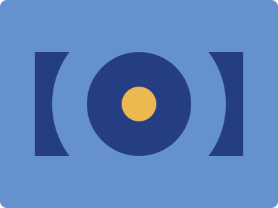

## CSS Battle #3 - Push Button

  
[See the daily target](https://cssbattle.dev/play/3)

### Challenge Overview

The challenge requires creating a design that resembles a push button using HTML and CSS. The target image displays a square-shaped button against a contrasting background.

### Method 1 - Reflection Button


**YouTube Video**: [see video](https://www.youtube.com/watch?v=sg5pY_UA6AM)

**Stats:**

- **Match:** 100%
- **Score:** 637.27{249}

### Code

```html
<a></a>
<p>
<style>
  body {
    background: #6592cf;
    display: grid;
    place-items: center;
  }
  a,
  p {
    position: absolute;
  }
  a {
    width: 300px;
    height: 150px;
    background: #243d83;
  }
  p {
    background: #eeb850;
    width: 50px;
    height: 50px;
    border-radius: 50%;
    border: 50px solid #243d83;
    box-shadow: 0 0 0 50px #6592cf;
  }
</style>
```

**Code Explanation:**

- **Background (`body`):** The `body` background color is set to a vibrant blue shade (`#6592cf`), providing a visually appealing backdrop for the button.

- **Button (`a`):** The `<a>` element represents the button shape, styled with a background color of `#243d83`, creating a contrast with the background.

- **Button (`p`):** The `<p>` element forms the circular shape inside the button, giving it a distinctive appearance. It is positioned at the center of the button, with a background color of `#eeb850` and a border to create a button-like effect.

- **Reflection Effect (`box-shadow`):** The `box-shadow` property is applied to the circular shape (`p`) to create a reflection effect. It adds a shadow with a large spread value to mimic a reflection, enhancing the visual appeal of the button.

This method effectively creates a button-like design with a reflection effect, achieving a perfect match and a high score.