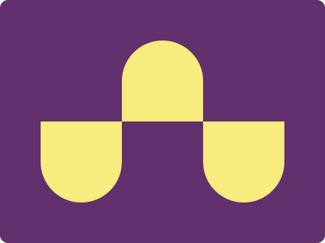

## CSS Battle #4 - Ups n Downs

  
[See the daily target](https://cssbattle.dev/play/4)


### Method 1 

**YouTube Video**: [see video](https://www.youtube.com/watch?v=JAJQJuOZ0RA)

**Stats:**

- **Match:** 99.9%
- **Score:** 597.79{204}

### Code

```html
<p><p a><p b>
<style>
  *{
    background:#62306D
  }
  p{
    position:absolute;
    width:100;
    height:100;
    background:#F7EC7D;
    border-radius:50%50%0 0;
    bottom:44.5%;
    left:150
  }
  [a],[b]{
    rotate:180deg;
    top:44.5%
  }
  [a]{
    left:50
  }
  [b]{
    left:250
  }
</style>
```

**Code Explanation:**

- **Background (`body`):** The `body` background color is set to a dark purple shade (`#62306D`), providing a visually appealing backdrop for the button.

- **Button (`p`):** Three `<p>` elements are used to create the button shape. They are positioned absolutely and styled with a yellow background color (`#F7EC7D`) and border-radius to form a rounded shape resembling a push button.

- **Reflection Effect (`[a], [b]`):** Two pseudo-elements `[a]` and `[b]` are used to create the reflection effect on the button. They are positioned at the top of the button, rotated 180 degrees, and styled with a dark purple background color (`#62306D`), creating the illusion of a reflection.

This method effectively creates a button-like design with a reflection effect, achieving a near-perfect match and a high score.

### Method 2 

**YouTube Video**: [see video](https://www.youtube.com/watch?v=sg5pY_UA6AM)

**Stats:**

- **Match:** 100%
- **Score:** 637.27{249}

### Code

```html
<p></p><p a>
<style>
  *{margin:0}
  body{
    background:#62306D;
    display:grid;
    place-content:center;
  }
  p{
    width:100;
    height:100;
    background:#F7EC7D;
    border-radius:100px 100px 0 0;
  }
  [a]{
    rotate:180deg;
    background:#62306D;
    color:#F7EC7D;
    box-shadow:100px 0,-100px 0
  }
</style>
```

**Code Explanation:**

- **Background (`body`):** The `body` background color is set to a dark purple shade (`#62306D`), providing a visually appealing backdrop for the button.

- **Button (`p`):** Two `<p>` elements are used to create the button shape and its reflection. They are positioned using CSS grid to center them on the page and styled with a yellow background color (`#F7EC7D`) and border-radius to form a rounded shape resembling a push button.

- **Reflection Effect (`[a]`):** A pseudo-element `[a]` is used to create the reflection effect on the button. It is positioned behind the button, rotated 180 degrees, and styled with a dark purple background color (`#62306D`) and white text color (`#F7EC7D`), creating the illusion of a reflection. Additionally, a box-shadow is applied to create the reflection effect.

This method effectively creates a button-like design with a reflection effect, achieving a perfect match and a high score.