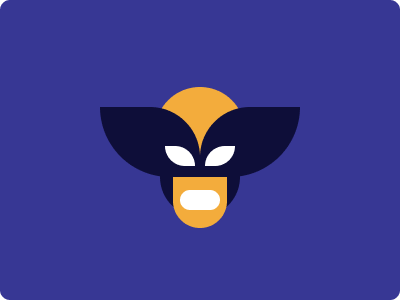

## CSS Battle #203 - Wolverine
  
[See the daily target](https://cssbattle.dev/play/203)


**YouTube Video**: [see video](https://www.youtube.com/watch?v=ZbzQwHI-_GI)

**Stats:**

- **Match:** 100%
- **Score:** 716.98{129}

### Code

```html
<p><a><b><c><d>
<style>
*{
  background:#373794
}
  p,a,b,c,d{
    position:fixed
  }
  p,a,b{
    background:#F3AC3C;
    padding:50+27;
    border-radius:50px;
    margin:120 165
  }
  p{
    box-shadow:0-23px 0 12.5px#0E0E39
  }
  a{
    margin:-92-44;
    padding:50+44
  }
  b,d{
    background:#FFF;
    margin:54-20;
    padding:10+20
  }
  c{
    background:#0E0E39;
    border-radius:0 50px 0 70px;
    padding:35+50;
    margin:-93-100;
    -webkit-box-reflect:right
  }
  d{
    padding:10+15;
    margin:4 15;
    border-radius:0 50px
  }
</style>
```

### Code Explanation:

- **Universal Selector (`*`)**:
  - **Background Color**: Sets the background color of the entire page to `#373794`, a deep blue shade.

- **Styles for `p, a, b, c, d` Tags**:
  - **Position**: Each element is fixed in place, ensuring it stays at a specific location on the viewport.

- **Styles for `p, a, b` Tags**:
  - **Background Color**: Sets the background color to `#F3AC3C`, a mustard yellow.
  - **Padding**: Uses a combination of padding values to adjust the size and positioning of each element.
  - **Border-radius**: Adds rounded corners with a `50px` radius to create circular or oval shapes.
  - **Margin**: The elements are spaced from the top, right, bottom, and left by specific values to position them on the page.

- **Styles for `p` Tag**:
  - **Box-shadow**: Creates a shadow above the `p` element using the color `#0E0E39` with a 12.5px spread to create depth.

- **Styles for `a` Tag**:
  - **Margin and Padding**: Adjusts the positioning and size of the `a` element, using negative values to overlap it with other elements.

- **Styles for `b, d` Tags**:
  - **Background Color**: Sets the background color to `#FFF`, white.
  - **Margin and Padding**: Adjusts the positioning and size of the `b` and `d` elements to fit within their respective containers.
  
- **Styles for `c` Tag**:
  - **Background Color**: Sets the background color to `#0E0E39`, a dark navy shade.
  - **Border-radius**: Creates an irregular shape with rounded corners on the top-right and bottom-left sides.
  - **-webkit-box-reflect**: Reflects the `c` element to the right side of the viewport, creating a symmetrical effect.

- **Styles for `d` Tag**:
  - **Padding and Margin**: Adjusts the positioning and size of the `d` element, ensuring it fits within the overall design.
  - **Border-radius**: Adds a rounded corner on the right side.

This setup accurately recreates the desired Wolverine shape using overlapping elements, specific positioning, padding, and border-radius settings. The use of fixed positioning, box-shadow, and WebKit reflection helps achieve the intricate design needed for this CSS Battle.