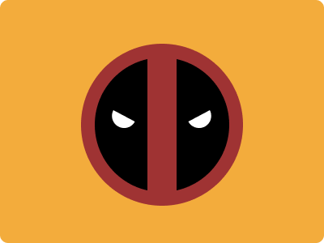

## CSS Battle #204 - Deadpool
  
[See the daily target](https://cssbattle.dev/play/204)


**YouTube Video**: [see video](https://www.youtube.com/watch?v=dvnVxfKjqGU)

**Stats:**

- **Match:** 100%
- **Score:** 623.81{296}

### Code

```html
<a><b>
<style>
*{
  background:#F3AC3C;
  *{
    background:linear-gradient(to right,#000 39%,#9F3333 0 61%,#000 0);
    border-radius:50%;
    margin:54 100 46
  }
  +*{
    border:17px solid#9F3333
  }
}
  a,b{
    position:fixed;
    background:linear-gradient(#000 50%,#FFF 0);
    padding:15;
    rotate:25deg;
    margin:57 21
  }
  b{
    rotate:-50deg;
    margin:-54 69
  }
</style>
```

### Code Explanation for Deadpool:

- **Universal Selector (`*`)**:
  - **Background Color**: Sets the background color of the entire page to `#F3AC3C`, a mustard yellow shade.

- **Nested Universal Selector (`* *`)**:
  - **Background**: Applies a linear gradient from black (`#000`) to dark red (`#9F3333`) back to black again, mimicking Deadpool's mask pattern.
  - **Border-radius**: Creates a circular shape for the nested elements.
  - **Margin**: Adjusts the spacing around these elements, positioning them within the page.
  
- **Adjacent Sibling Selector (`* + *`)**:
  - **Border**: Adds a solid border of `17px` with the dark red color `#9F3333`, creating the distinct border between the black and red portions of Deadpool's mask.

- **Styles for `a, b` Tags**:
  - **Position**: Fixes the elements in place, so they remain in specific positions on the viewport.
  - **Background**: Adds a linear gradient to create the eye areas of Deadpool's mask, with the top half black and the bottom half white.
  - **Padding**: Provides spacing inside the elements to control their size.
  - **Rotate**: Rotates the elements to align them with the angles needed to form Deadpool's eye shapes.
  - **Margin**: Adjusts the positioning of the `a` and `b` elements on the page, ensuring they overlap correctly to form the eye shapes.

### Visual Breakdown:

This setup uses multiple CSS properties to recreate Deadpool's mask by strategically positioning and styling `a` and `b` tags to represent the eyes and the mask's red-black pattern. The linear gradients, rotations, and fixed positioning create the necessary shapes and align them to resemble the target image accurately.