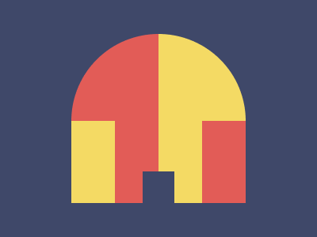

# ✅ CSS Battle #237 - Round castle

  
[Play Challenge](https://cssbattle.dev/play/237)  
[Watch Solution Video](https://www.youtube.com/watch?v=nP3u_5lynGM)

---

## 🔢 Stats

**Match**: ✅ 100%  
**Score**: 🟢 640.23 (Characters: 241)

---

## ✅ Code

```html
<p>
<style>
*{
  background:#3F4869;
  +*{
    background:linear-gradient(to left,#F4DA64 50%,#E25C57 0);
    margin:43 90;
    border-radius:2in 2in 0 0
  }
}
  p{
    position:fixed;
    padding:44+19.5;
    margin:174 90.5;
    box-shadow:-83px -56px 0 8px#F4DA64,83px -56px 0 8px#E25C57
  }
</style>
```

---

## ✅ Code Explanation

This solution builds a **round castle with two symmetrical towers** using a single `<p>` tag and powerful CSS tricks. The layout relies on clever use of the universal selector, adjacent sibling selector, gradients, border radii, and box shadows — all optimized for minimal character usage.

---

### 🎯 Visual Structure

* The background of the entire page is filled with a dark bluish color (`#3F4869`), establishing the night-sky setting.
* The first visible shape (a large yellow-red dome) is created using the adjacent sibling selector `* + *`. It applies a **linear gradient** from yellow (`#F4DA64`) to red (`#E25C57`), split evenly at 50%. This dome represents the **main castle roof**.
* A large top border radius rounds both top corners using `border-radius: 2in 2in 0 0`, forming a perfect semi-circle.
* The `<p>` element itself is placed fixed at the bottom and contains **box shadows** representing **two smaller circular towers**, flanking the dome symmetrically.

---

### 🧠 Key Techniques

* **Adjacent Sibling Selector (`+*`)** is used to target the element right after the first (in this case, `<p>`), allowing it to receive styling without additional tags or IDs.
* **Linear Gradient** is used creatively to split the dome into two distinct halves, visually suggesting two materials or lighting effects.
* **Box Shadows** on the `<p>` element replicate round turrets or castle accents by placing colored circles using horizontal offsets and blur.
* **Position Fixed** is applied to ensure the base and shadows stay in place relative to the viewport, crucial for a fixed layout typical in CSS Battles.
* **Shorthand margin and padding** are used efficiently to position the elements without lengthy declarations.

---

### 📦 Final Layout Summary

* Central dome (gradient-filled) = main castle.
* Two small circular turrets = left and right box shadows.
* No extra elements needed; all visual depth comes from shadows and gradients.
* Fully symmetrical layout using only one tag and selector logic.