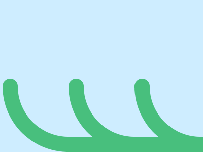

# ✅ CSS Battle #239 - Waves

  
[Play Challenge](https://cssbattle.dev/play/239)  
[Watch Solution Video](https://www.youtube.com/watch?v=vCbE47TM0PM)

---

## 🔢 Stats

**Match**: ✅ 100%  
**Score**: 🟢 632.93 (Characters: 262)

---

## ✅ Code

```html
<p><a><b><c>
<style>
*{
  background:#CEEDFF;
  position:fixed;
  color:48BF7D
}
  p,a,b{
    padding:50+120;
    margin:162-3;
    border-style:solid;
    border-width:0 0 30 30;
    border-radius:0 0 0 2in
  }
  a,b{
    margin:-50-20
  }
  c{
    border:16q solid;
    margin:-65-410;
    border-radius:50%;
    box-shadow:138q 0,275q 0
  }
</style>
```

---

## ✅ Code Explanation

This solution recreates the **“Waves”** challenge using three nested tags and concise CSS to simulate rolling wave shapes on a blue background.

---

### 🎯 Visual Structure

* The **background** (`#CEEDFF`) is applied globally using the `*` selector, setting a pale blue base to represent the sea and sky.
* Three identical elements (`<p>`, `<a>`, `<b>`) are styled to create **stacked wave arcs** using borders and border-radius.
* Each of these elements has:

  * `border-width: 0 0 30 30`: creates only the bottom and left sides.
  * `border-radius: 0 0 0 2in`: rounds the bottom-left corner, forming a wave arc.
  * Large `padding` and `margin` values to define their size and shift their position diagonally.

---

### 🧠 Techniques Used

* **Mathematical expressions** like `50+120` and `162-3` are evaluated by the browser and used to reduce character count.
* **Shared styles** are grouped: `p`, `a`, and `b` all receive similar padding, margin, and border styles to avoid repetition.
* **Stacking**: By adjusting margins (`-50-20`) on `<a>` and `<b>`, the arcs are layered diagonally to create the impression of multiple waves.
* **Fixed positioning** ensures all elements stay anchored in place across the viewport.
* The final element `<c>` creates **a circular shape** (`border-radius: 50%`) with a `box-shadow` that duplicates it horizontally, giving the effect of **bubbles or floating elements**.

---

### 📦 Final Layout Summary

* `#CEEDFF` background = sky/sea
* Three stacked arcs using borders = stylized wave layers
* Circular green element with shadow = bubbles or decorative accents
* Minimal, elegant structure using **three tags and smart layering** to simulate motion and depth.
