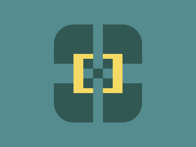

# ✅ CSS Battle #240 - Snapshot

  
[Play Challenge](https://cssbattle.dev/play/240)  
[Watch Solution Video](https://www.youtube.com/watch?v=u-_AzCzVG5g)

---

## 🔢 Stats

**Match**: ✅ 100%  
**Score**: 🟢 622.92 (Characters: 300)

---

## ✅ Code

```html
<p><a>
<style>
*{
  background:#558C90;
  +*{
    background:#325853;
    margin:50 110;
    border-radius:42q;
    *{
      position:fixed;
      -webkit-box-reflect:left 22q
    }
  }
}
  p{
    padding:10;
    margin:90 100;
    color:325853;
    box-shadow:0 21q,0-21q,11q -21q 0 11q#F4DA64,11q 21q 0 11q#F4DA64,53q 0 0 11q#558C90
  }
  a{
    padding:10+60;
    margin:60-80;
    rotate:90deg
  }
</style>
```

---
