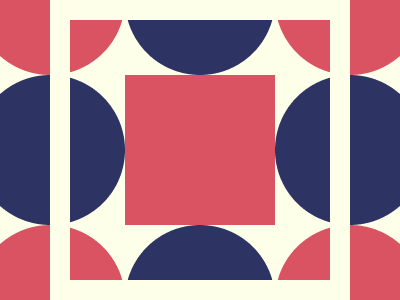

# ✅ CSS Battle #242 - Orbital Tiles

  
[Play Challenge](https://cssbattle.dev/play/242)  
[Watch Solution Video](https://www.youtube.com/watch?v=oiKe9b0nmbo)

---

## 🔢 Stats

**Match**: ✅ 99.9%  
**Score**: 🟢 597.67 (Characters: 266)

---

## ✅ Code

```html
<p>
<style>
*{
  background:#FDFFE9;
  +*{
    margin:75 125;
    border-radius:50%;
    color:2D3464;
    box-shadow:-159q 0,0 159q,159q 0,0-159q,-159q -159q#D95362,-159q 159q#D95362,159q 159q#D95362,159q -159q#D95362;
    *{
      padding:75;
      background:#D95362;
      outline:22q solid#FDFFE9;
      outline-offset:59q
    }
  }
}
</style>
```

---
