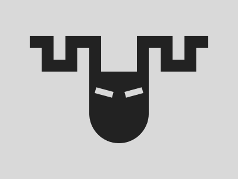

# 🎯 CSS Battle #244 – **Medusa**

  

🎮 [**Play Challenge**](https://cssbattle.dev/play/244)

---

## 📈 Battle Stats

| 🧩 Metric      | 🔹 Value  |
| :------------- | :-------- |
| **Match**      | ✅ 100%    |
| **Score**      | 🟢 624.98 |
| **Characters** | ✏️ 291    |

---

## 💻 Solution

```html
<p><a><b>
<style>
*{
  background:#D9D9D9;
  +*,p{
    background:#222
  }
  +*{
    margin:120 150 60;
    border-radius:0 0 55q 55q;
    *{
      position:fixed;
      padding:30+60;
      margin:-60 80
    }
  }
}
  p{
    -webkit-box-reflect:left 63q
  }
  a{
    padding:20+10;
    margin:-30 0;
    color:D9D9D9;
    box-shadow:43q 22q,-43q 22q
  }
  b{
    padding:15+5;
    margin:60-80;
    rotate:75deg
  }
</style>
```

---
