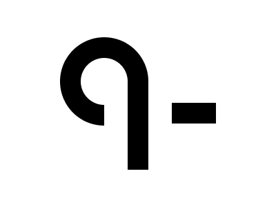

# 🎯 CSS Battle #245 – **Knot**

  

🎮 [**Play Challenge**](https://cssbattle.dev/play/245)

---

## 📈 Battle Stats

| 🧩 Metric      | 🔹 Value  |
| :------------- | :-------- |
| **Match**      | ✅ 100%    |
| **Score**      | 🟢 656.15 |
| **Characters** | ✏️ 206    |

---

## 💻 Solution

```html
<p><a><b><c>
<style>
*{
  background:#FFF;
  position:fixed
}
  p{
    padding:34;
    border:32q solid;
    border-radius:50%;
    margin:46 79
  }
  a{
    padding:35+17
  }
  b,c{
    padding:60+15;
    background:#000;
    margin:-27 17
  }
  c{
    padding:15+32;
    margin:-37 49
  }
</style>
```

---
