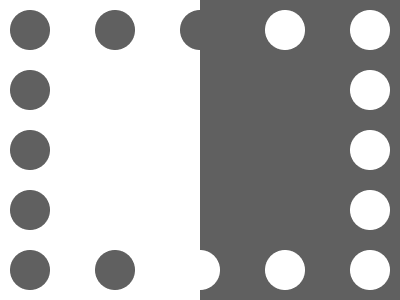

# 🎯 CSS Battle #247 – **LEDs**

  

🎮 [**Play Challenge**](https://cssbattle.dev/play/247)

---

## 📈 Battle Stats

| 🧩 Metric      | 🔹 Value  |
| :------------- | :-------- |
| **Match**      | ✅ 100%    |
| **Score**      | 🟢 641.39 |
| **Characters** | ✏️ 238    |

---

## 💻 Solution

```html
<p><a>
<style>
*{
  background:#606060;
  +*,a{
    background:#FFF;
    margin:0 200 0 0
  }
}
  p,a{
    position:fixed;
    padding:20;
    border-radius:50%;
    margin:10;
    color:606060;
    box-shadow:90q 0,180q 0,0 64q,0 127q,0 190q,0 254q,90q 254q
  }
  a{
    color:FFF;
    scale:-1;
    margin:220 320
  }
</style>
```

---
