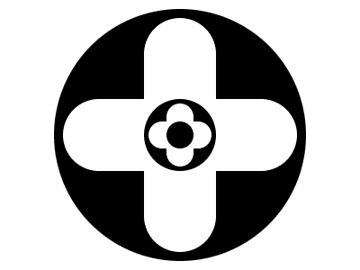

# 🎯 CSS Battle #248 – **Recursion**

  

🎮 [**Play Challenge**](https://cssbattle.dev/play/250)

---

## 📈 Battle Stats

| 🧩 Metric      | 🔹 Value  |
| :------------- | :-------- |
| **Match**      | ✅ 100%    |
| **Score**      | 🟢 634.21 |
| **Characters** | ✏️ 258    |

---

## 💻 Solution

```html
<p><a><a><b><c><d>
<style>
*{
  background:#FFF;
  border-radius:2in;
  +*,d{
    background:#000;
    margin:10 60;
    *{
      position:fixed
    }
  }
}
  p,a{
    padding:130+40;
    margin:10 100
  }
  a,c{
    rotate:90deg;
    margin:-130-40
  }
  a+a{
    padding:40;
    margin:-40
  }
  b,c{
    padding:35+15;
    margin:-35-15
  }
  d{
    padding:15;
    margin:-15
  }
</style>
```

---
