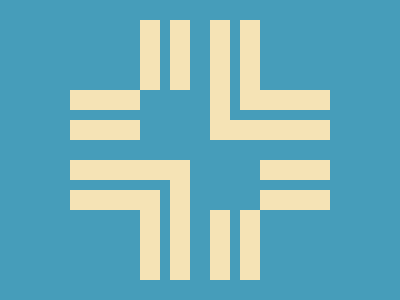

# 🎯 CSS Battle #255 – Crossroads

  

[**Play Challenge**](https://cssbattle.dev/play/255)  
[**Watch Solution Video**](https://youtu.be/G7y0GfQHlUQ)

---

## 📈 Battle Stats

| Metric         |  Value    |
| :------------- | :-------- |
| **Match**      |  100%     |
| **Score**      |  624.04   |
| **Characters** |  295      |

---

## 💻 Solution

```html
<p><a><b><c><d><e><f><g>
<style>
  *{
    background:#469DBA;
    *:not(g){
      margin:20 210 160 70;
      border:solid;
      color:F5E3B5;
      border-width:0 22q 22q 0;
      *{
        position:fixed;
        padding:35;
        margin:0
      }
    }
  }
  a,c,e{
    padding:50;
    scale:-1;
    margin:105;
  }
  b,d,f{
    margin:-50
  }
  c{
    rotate:90deg;
    margin:105-35
  }
  g{
    margin:85 35;
    box-shadow:53q -53q#469DBA
  }
</style>
```

---
