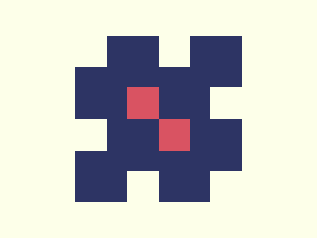

# 🎯 CSS Battle #257 – Cluster

  

[**Play Challenge**](https://cssbattle.dev/play/257)  
[**Watch Solution Video**](https://youtu.be/q8wD84q7AtA)

---

## 📈 Battle Stats

| Metric         |  Value    |
| :------------- | :-------- |
| **Match**      |  100%     |
| **Score**      |  662.36   |
| **Characters** |  195      |

---

## 💻 Solution

```html
<p><a>
<style>
*{
  background:#FDFFE9;
  *{
    background:#2D3464;
    margin:45 95
  }
}
  p,a{
    position:fixed;
    padding:20;
    background:#D95362;
    margin:65;
    color:FDFFE9;
    box-shadow:112q 0,0 112q,112q 112q
  }
  a{
    scale:-1;
    margin:20
  }
</style>
```

---
