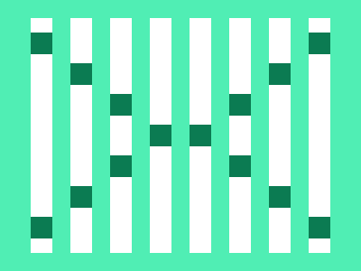

# 🎯 CSS Battle #259 - Rhythm

  

[**Play Challenge**](https://cssbattle.dev/play/259)  
[**Watch Solution Video**](https://youtu.be/ekSzP8lKYYk)

---

## 📈 Battle Stats

| Metric         |  Value    |
| :------------- | :-------- |
| **Match**      |  100%     |
| **Score**      |  628.54   |
| **Characters** |  277      |

---

## 💻 Solution

```html
<p>
<style>
*{
  background:#50EEB4;
  *{
    background:#FFF;
    margin:20 166 20 210;
    color:FFF;
    box-shadow:44px 0,88px 0,132px 0
  }
  +*{
    -webkit-box-reflect:left 20px
  }
}
  p{
    position:fixed;
    padding:12;
    margin:118 44;
    color:0B7B52;
    box-shadow:-44px 0,0-34px,0 34px,44px -68px,44px 68px,88px 102px,88px -102px
  }
</style>
```

---
