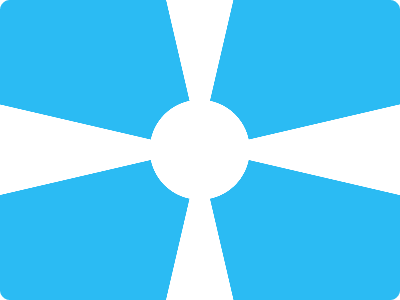

# CSS Battle Daily Targets: 1/3/2024

### Daily Targets to Solve

  
[see the daily target](https://cssbattle.dev/play/zgmRBxSPDFV9HOQJYazS)

### Description

In this challenge, the objective is to create a visually captivating set of quadrant shapes using HTML and CSS. Each quadrant (`q1`, `q2`, `q3`, `q4`) is composed of three distinct elements - a circular shape (`cir`) and two triangular shapes (`tri1` and `tri2`). The entire composition is set against a stylish blue background (`#2bbbf3`).

### Stats

**Match**: 99.8%  
**Score**: 593.72{1238}

### Code

```html
<div class="qua q1">
  <div class="cir"></div>
  <div class="tri1"></div>
  <div class="tri2"></div>
</div>
<div class="qua q2">
  <div class="cir"></div>
  <div class="tri1"></div>
  <div class="tri2"></div>
</div>
<div class="qua q3">
  <div class="cir"></div>
  <div class="tri1"></div>
  <div class="tri2"></div>
</div>
<div class="qua q4">
  <div class="cir"></div>
  <div class="tri1"></div>
  <div class="tri2"></div>
</div>
<style>
  *,
  *::before,
  *::after {
    margin: 0;
    padding: 0;
    border: 0;
  }
  body {
    margin: 0;
    display: flex;
    flex-wrap: wrap;
  }
  .qua {
    width: 50%;
    height: 50%;
    background: #2bbbf3;
    position: relative;
  }
  .qua div {
    position: absolute;
    background: #fff;
  }

  .cir {
    height: 50px;
    width: 50px;
    bottom: 0;
    right: 0;
    border-top-left-radius: 100%;
    z-index: 2;
  }
  .tri1 {
    height: 0;
    width: 5px;
    top: 0;
    right: 0;
    border-left: 30px solid #2bbbf3;
    border-top: 150px solid transparent;
  }

  .tri2 {
    width: 0;
    height: 0;
    bottom: 0;
    border-top: 45px solid #2bbbf3;
    border-left: 200px solid transparent;
  }
  .q2 {
    transform: scaleX(-1);
  }
  .q3 {
    transform: scaleY(-1);
  }
  .q4 {
    transform: scale(-1);
  }
</style>
```

### Code Explanation

- **Background (`body`):** The background color is set to a stylish blue (#2bbbf3), creating a modern and visually appealing canvas for the shapes.

- **Quadrants (`qua`):** Four quadrants (`q1`, `q2`, `q3`, `q4`) are created using the `.qua` class, each occupying 50% of the width and height of the viewport. The quadrants serve as containers for the circular and triangular shapes.

- **Shapes (`cir`, `tri1`, `tri2`):** Each quadrant contains a circular shape (`cir`) and two triangular shapes (`tri1` and `tri2`). The circular shape is positioned at the bottom right corner of the quadrant, creating a visually pleasing anchor point. The two triangular shapes are strategically placed to form an intricate pattern, contributing to the overall visual appeal.

- **Transformations (`.q2`, `.q3`, `.q4`):** The use of transformations (`scaleX`, `scaleY`, and `scale`) on the quadrants allows for mirroring and flipping, enhancing the symmetry and balance of the overall design.

This code successfully accomplishes the challenge by creating a visually captivating composition of shapes within quadrants against a stylish blue background. The high match percentage and score indicate a successful implementation of the specified requirements.
