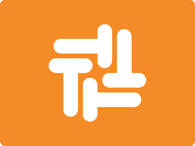

# CSS Battle Daily Targets: 3/3/2024

### Daily Targets to Solve
  
[see the daily target](https://cssbattle.dev/play/mrt5Q0vjIWvZV2LPSUC8)  
Check out the solution video on [YouTube](https://www.youtube.com/watch?v=x9z_7vaaIK8)

### Description

For this challenge, the objective is to craft a captivating composition of quadrant shapes using HTML and CSS. Each quadrant (`a`, `b`, `c`, `d`) comprises two stylized rectangular sections (`s1` and `s2`) forming a circular pattern against a lively orange background (`#f48b26`).

### Stats
**Match**: 99.9%  
**Score**: 596.56{820}

### Code

```html
<div class="a">
  <div class="s1"></div>
  <div class="s2"></div>
</div>
<div class="b">
  <div class="s1"></div>
  <div class="s2"></div>
</div>
<div class="c">
  <div class="s1"></div>
  <div class="s2"></div>
</div>
<div class="d">
  <div class="s1"></div>
  <div class="s2"></div>
</div>
<style>
  body {
    background: #f48b26;
  }

  div {
    position: absolute;
    background: #fff;
    border-radius: 50px;
  }
  .a,
  .b,
  .c,
  .d {
    position: relative;
  }
  .s1,
  .s2 {
    width: 105px;
    height: 30px;
  }
  .s2 {
    left: 60px;
    width: 90px;
    rotate: 90deg;
  }
  .a {
    top: 72px;
    left: 102px;
  }
  .b {
    top: 245px;
    left: 70px;
    rotate: 90deg;
  }
  .c {
    top: 212px;
    left: -102;
    rotate: 180deg;
  }
  .d {
    top: 40px;
    left: -70px;
    rotate: 270deg;
  }
</style>
```
### Design Explanation

- **Background (`body`):** The background color is set to a vibrant orange (#f48b26), creating a lively and energetic atmosphere.

- **Quadrant Shapes (`a`, `b`, `c`, `d`):** Four quadrants are created, each consisting of two stylized rectangular sections (`s1` and `s2`). The positioning and rotation of these elements form a circular pattern.

- **Rectangular Sections (`s1`, `s2`):** These elements represent the rectangular sections forming the circular pattern in each quadrant. They have specific widths, heights, and positions, contributing to the overall composition.

- **Positioning (`top`, `left`):** The positioning of each quadrant and its elements is carefully adjusted to achieve symmetry and the desired circular arrangement.

- **Rotation (`rotate`):** The rotation property is used to position the rectangular sections (`s2`) at different angles, contributing to the circular pattern.

This code successfully achieves the challenge by creating a visually captivating composition of quadrant shapes, resulting in a high match percentage and score.