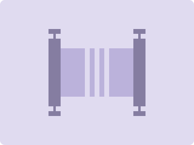

# CSS Battle Daily Targets: 19/3/2024

### Daily Targets to Solve

  
[see the daily target](https://cssbattle.dev/play/sXh0k2RFohqcShlXFkeP)  
Check out the solution video on [YouTube](https://www.youtube.com/watch?v=zOvwzk6c5iE)

### Stats

**Match**: 99.8%  
**Score**: 595.28{459}

### Code

```html
<div><i><a></a><p a></p><p></p></i></div>
<style>
  *{
    background:#E0DBF0;
    margin:0
  }
  div{
    position:absolute;
    bottom:50%;
    right:50%;
    -webkit-box-reflect:below -1px
  }
  i{
    display:flex;
    align-items:flex-end;
    -webkit-box-reflect:right  }
  p{
    background:#BBB2DB;
    height:50;
    width:10;
    margin-right:5
  }
  [a]{
    width:50;
    margin-right:10
  }
  a{
    width:25;
    height:91;
    margin-bottom:-1px;
    background:#857DA1;
    clip-path:polygon(0%0%,100%0%,100%11%,60%11%,60%22%,100%22%,100%100%,0%100%,0%22%,40%22%,40%11%,0%11%)
  }
</style>
```

### Code Explanation

- **Background (`body`):** The `body` background color is set to a light purple shade (`#E0DBF0`), providing a calm and soothing backdrop for the shapes.

- **Container (`div`):** A `<div>` element serves as the container for the shapes. It is positioned absolutely at the bottom right corner of the viewport.

- **Flex Layout (`i`):** The `<i>` element is used to create a flex container for aligning its child elements. It aligns its child elements at the end of the flex container, allowing them to be positioned at the bottom.

- **Shapes (`p`, `a`):** Three elements contribute to the design: two `<p>` elements and one `<a>` element. The `<p>` elements represent horizontal rectangles, while the `<a>` element represents a vertical rectangle. Each element is styled with background colors to create the desired appearance.

- **Positioning (`position`, `bottom`, `right`):** The container `<div>` is positioned absolutely at the bottom right corner of the viewport using the `bottom` and `right` properties.

- **Reflection Effect (`-webkit-box-reflect`):** The `-webkit-box-reflect` property is used to create a reflection effect below the container `<div>`, adding a visual touch to the design.

- **Dimensions and Styling (`width`, `height`, `background`, `clip-path`):**
  - The `<p>` elements (`[a]` and `[b]`) have specified dimensions and background colors to create the desired rectangular shapes.
  - The `<a>` element is styled with a clip-path property to create a custom shape resembling a folded ribbon, enhancing the visual appeal of the design.

Overall, the code achieves a visually dynamic composition with rectangular shapes and a unique folded ribbon element against a light purple background, achieving a near-perfect match and a high score.