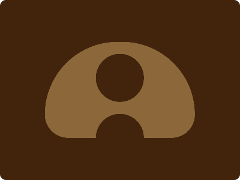

# CSS Battle Daily Targets: 20/3/2024

### Daily Targets to Solve

  
[see the daily target](https://cssbattle.dev/play/28n8LsvPnxFKQh46G3iZ)  
Check out the solution video on [YouTube](https://www.youtube.com/watch?v=d0rsqW3Qhvc)

### Stats

**Match**: 99.9%  
**Score**: 597.79{205}

### Code

```html
<p>
<style>
  *{
    background:#42230C
  }
  body{
    background:#8B673A;
    margin:69.5 75;
    border-radius:125px 125px 40px 40px
  }
  p{
    position:absolute;
    margin:20 85 0;
    height:80;
    width:80;
    border-radius:50%;
    box-shadow:0 100px#42230C
  }
</style>
```

### Code Explanation

- **Background (`body`):** The `body` background color is set to a dark brown shade (`#42230C`), creating a solid backdrop for the shapes.

- **Container (`body`):** The `body` element serves as the container for the shapes. It has a background color of `#8B673A`, which is a lighter shade of brown, giving the appearance of a wooden surface. The container also has a margin of 69.5 pixels from the top and 75 pixels from the left, giving it a centered appearance.

- **Shapes (`p`):** A single `<p>` element represents the shape in this design. It is positioned absolutely within the container. The `<p>` element is circular, with a height and width of 80 pixels, and a border-radius of 50%, giving it a perfect circular shape.

- **Shadow Effect (`box-shadow`):** The `<p>` element has a box-shadow applied to it, creating a shadow effect below it. The shadow is 100 pixels in size and is colored with the same dark brown shade as the background (`#42230C`), giving the appearance of depth and elevation.

- **Dimensions and Positioning (`margin`):** The `<p>` element has a margin of 20 pixels from the top and 85 pixels from the left, positioning it within the container.

Overall, the code creates a visually appealing composition with a circular shape resembling a button placed on a wooden surface. The shadow effect adds depth to the button, enhancing its visual appeal.