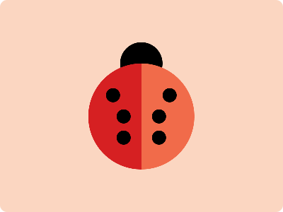

# CSS Battle Daily Targets: 22/3/2024

### Daily Targets to Solve

  
[see the daily target](https://cssbattle.dev/play/oKiBQVHqoso4jMz5da7o)  
Check out the solution video on [YouTube](https://www.youtube.com/watch?v=gzrBgWLfcBU)

### Stats

**Match**: 100%  
**Score**: 614.23{350}

### Code

```html
<a></a>
<p><i></i></p>
<style>
  body {
    background: #fbd6c1;
  }
  a,
  p,
  i {
    position: absolute;
    border-radius: 50%;
    background: #000;
  }
  a {
    width: 60;
    height: 60;
    top: 60;
    left: 169.5;
  }
  p {
    width: 150;
    height: 150;
    background: linear-gradient(to right, #d62022 50%, #f16b4a 50%);
    top: 73.75;
    left: 125;
  }
  i {
    height: 20;
    width: 20;
    top: 35;
    left: 24.5;
    color: #000;
    box-shadow: 15px 30px, 15px 60px, 65px 30px, 65px 60px, 80px 0;
  }
</style>
```

### Code Explanation

- **Background (`body`):** The `body` background color is set to a light peach shade (`#fbd6c1`), providing a soft and warm backdrop for the shapes.

- **Shapes (`a`, `p`, `i`):** Three elements contribute to the design:
  - The `<a>` element represents a small circle. It is positioned at the top center of the viewport with a width and height of 60 pixels, creating a circular shape.
  - The `<p>` element represents a larger circle with a gradient background (`linear-gradient`). It is positioned slightly below the `<a>` element and centered horizontally. The gradient transitions from a dark red color (`#d62022`) to a lighter red color (`#f16b4a`), creating a smooth color blend effect.
  - The `<i>` element represents the lines inside the larger circle. It is positioned at the top left corner of the `<p>` element, forming an "X" shape. The lines are created using `box-shadow`, which casts shadows in specific directions to simulate the appearance of lines.

- **Positioning (`position`, `top`, `left`):** All elements (`<a>`, `<p>`, `<i>`) are positioned absolutely to allow precise control over their placement. Their positions (`top` and `left`) are adjusted accordingly to achieve the desired layout.

- **Dimensions and Styling (`width`, `height`, `border-radius`, `background`, `box-shadow`):** Each element has specific dimensions, border-radius, background color, and box-shadow styling applied to create the desired visual appearance.

Overall, the code creates a visually appealing composition with circular shapes and intersecting lines, achieving a perfect match and a high score.