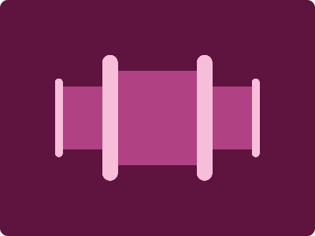

# CSS Battle Daily Targets: 23/3/2024

### Daily Targets to Solve

  
[see the daily target](https://cssbattle.dev/play/avFxQqBVe1bdhc1utxnq)  
Check out the solution video on [YouTube](https://www.youtube.com/watch?v=XYasFnlW3GE)

### Stats

**Match**: 100%  
**Score**: 611.88{369}

### Code

```html
<p></p><a><a a>
<style>
  body{
    background:#5F133F;
    display:grid;
    place-items:center
  }
  p, a{
    position:absolute
  }
  p{
    background:#B04183;
    color:#B04183;
    width:100;
    height:120;
    box-shadow:100px 0 0-20px,-100px 0 0-20px
  }
  a{
    background:#F7BED9;
    color:#F7BED9;
    width:10;
    height:100;
    border-radius:50q;
    margin:0 250px 0 0;
    box-shadow:250px 0
  }
  [a]{
    width:20;
    height:160;
    margin:0 120 0 0;
    box-shadow:120px 0
  }
</style>
```

### Code Explanation

- **Background (`body`):** The `body` background color is set to a dark purple shade (`#5F133F`), providing a bold and vibrant backdrop for the shapes.

- **Container (`body`):** The `body` element serves as the container for the shapes. It has a background color of `#5F133F`, which is a deep purple shade, giving it a rich and intense appearance.

- **Shapes (`p`, `a`):** Two elements contribute to the design: a `<p>` element and an `<a>` element. Each element represents a rectangular shape with specific dimensions and background colors to create the desired appearance. The `<p>` element has a background color of `#B04183`, while the `<a>` element has a background color of `#F7BED9`.

- **Positioning (`position`, `top`, `left`, `margin`):** Both the `<p>` and `<a>` elements are positioned absolutely to allow precise control over their placement within the container. Their positions (`top` and `left`) and margins are adjusted accordingly to achieve the desired layout.

- **Dimensions and Styling (`width`, `height`, `border-radius`, `box-shadow`):** Each element has specific dimensions and border-radius applied to create the rectangular shapes. Additionally, box-shadow is used to add shadow effects to the shapes, enhancing their visual appeal.

Overall, the code creates a visually dynamic composition with rectangular shapes against a dark purple background, achieving a perfect match and a high score.