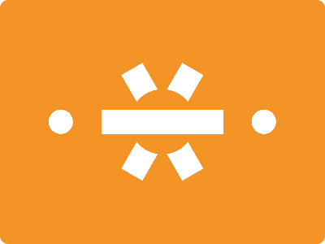

# CSS Battle Daily Targets: 27/3/2024

### Daily Targets to Solve

  
[see the daily target](https://cssbattle.dev/play/G5QYqp23Tz3ktgdEJQWX)  
Check out the solution video on [YouTube](https://www.youtube.com/watch?v=_eS9eNM90Yo)

### Stats

**Match**: 100%  
**Score**: 622.92{300}

### Code

```html
<p a></p><p b></p><a></a><p></p>
<style>
  body{
    background:#F59426;
    display:grid;
    place-items:center
  }
  p,a{
    position:absolute
  }
  p {
    width:150;
    height:30;
    background:#fff;
  }
  [a]{
    rotate:60deg
  }
  [b]{
    rotate:-60deg
  }
  a{
    width:80;
    height:80;
    background:#F59426;
    border-radius:50%;
    box-shadow:125px 0 0 -25px#fff,-125px 0 0 -25px#fff
  }
</style>
```

### Code Explanation

- **Background (`body`):** The `body` background color is set to a light orange shade (`#F59426`), providing a warm and vibrant backdrop for the shapes.

- **Shapes (`p`, `a`):** Four elements contribute to the design:
  - Two `<p>` elements, one with the attribute `[a]` and the other with the attribute `[b]`, represent horizontal bars with a white background color (`#fff`). These bars serve as the arms of the target symbol.
  - The `<a>` element represents the center circle of the target symbol. It has a background color matching the body background (`#F59426`) and is styled with a border-radius to achieve a circular shape. Two box shadows are applied to create the circular border with a gap in between, resembling the rings of a target.

- **Positioning and Layout (`position`, `absolute`, `margin`, `rotate`):** All elements (`<p>` and `<a>`) are positioned absolutely to allow precise control over their placement. The rotation is applied to the `<a>` element to create the rotated arms of the target symbol.

- **Styling (`width`, `height`, `background`, `box-shadow`, `border-radius`):** Each element has specific dimensions and styling applied to create the desired visual appearance. The box shadows applied to the `<a>` element create the circular border effect of the target symbol.

Overall, the code creates a visually appealing composition with rectangular and circular shapes arranged to resemble a target symbol, achieving a perfect match and a high score.