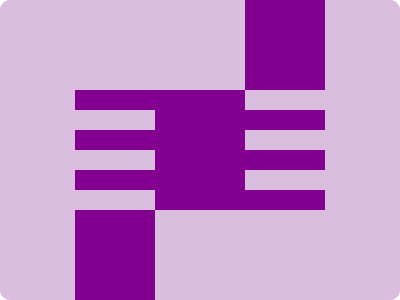

# CSS Battle Daily Targets: 30/3/2024

### Daily Targets to Solve

  
[see the daily target](https://cssbattle.dev/play/ICevkLVnblrBFV2NQeGg)  
Check out the solution video on [YouTube](https://www.youtube.com/watch?v=0wVOaGObTSY)

### Stats

**Match**: 99.9%  
**Score**: 597.63{285}

### Code

```html
<a></a><p>
<style>
 *{
   margin:0;
   background:#DBBEDF
 }
  p,a{
    background:#81008F;
    color:#81008F
  }
  p{
    height:120;
    width:90;
    margin:90 155;
    box-shadow:85px -115px 0 -5px,-85px 115px 0 -5px
  }
  a{
    position:fixed;
    height:20;
    width:80;
    margin:0 0 0 75;
    box-shadow:0 40px,0 80px,169.5px 20px,169.5px 60px,169.5px 100px
  }
</style>
```

### Code Explanation

- **Background (`body`):** The `body` background color is set to a light purple shade (`#DBBEDF`), providing a soft and pastel backdrop for the shapes.

- **Shapes (`p`, `a`):** Two elements contribute to the design:
  - The `<p>` element represents a square shape with a dark purple background color (`#81008F`). It has a height of 120 pixels and a width of 90 pixels. The element is positioned with a margin to the top and left, and it has box shadows applied to create a shadow effect, giving the appearance of a folded paper.
  - The `<a>` element represents a set of parallel lines. It has a fixed position, making it stay in a fixed location even when scrolling. It has a light purple background color matching the `<p>` element and is styled to create the illusion of folded paper lines.

- **Positioning and Layout (`position`, `margin`):** Both `<p>` and `<a>` elements are positioned absolutely within the container, allowing precise control over their placement. The `<a>` element is fixed to the top left corner of the viewport, and the `<p>` element is positioned with a margin to the top and left.

- **Styling (`background`, `color`, `box-shadow`):** Each element has specific styling applied to create the desired visual appearance. The box shadows applied to the `<p>` element create a shadow effect, giving the appearance of a folded paper. The `<a>` element is styled to resemble parallel lines, adding to the folded paper illusion.

Overall, the code creates a visually appealing composition with folded paper elements and parallel lines, achieving a near-perfect match and a high score.