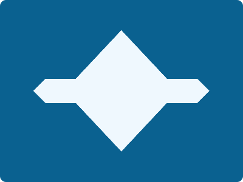

# CSS Battle Daily Targets: 1/4/2024

### Daily Targets to Solve

  
[see the daily target](https://cssbattle.dev/play/nyLtfFAYLNJc0E4bUfql)  
Check out the solution video on [YouTube](https://www.youtube.com/watch?v=Nhed86N0PMA)

### Stats

**Match**: 100%  
**Score**: 685.41{162}

### Code

```html
<style>
*{
  background:#0A6190;
  +*{
    background:#EFF8FE;
    margin:50 55;
    clip-path:polygon(7%40%,24%40%,50%0,76%40%,93%40%,100%50%,93%60%,76%60%,50%100%,24%60%,7%60%,0%50%)
  }
}
</style>
```

### Code Explanation

- **Background (`body`):** The `body` background color is set to a dark blue shade (`#0A6190`), providing a bold and intense backdrop for the shapes.

- **Shapes (`*`, `+*`):** Two elements contribute to the design:
  - The `*` selector targets all elements on the page. In this case, it selects the first square shape with a light blue background color (`#EFF8FE`). The shape of the square is defined using the `clip-path` property with a polygon value, creating a hexagon shape.
  - The `+*` selector targets all elements immediately following the first square shape. In this case, it selects the second square shape with the same light blue background color (`#EFF8FE`). The `clip-path` property with a polygon value is applied to this square, creating another hexagon shape.

- **Positioning and Layout (`clip-path`):** Both square shapes are shaped into hexagons using the `clip-path` property with polygon values.

- **Styling (`background`):** Each element has specific styling applied to create the desired visual appearance. The background color of both elements is set to a light blue shade (`#EFF8FE`).

Overall, the code creates a visually appealing composition with two hexagonal shapes, achieving a perfect match and a high score.