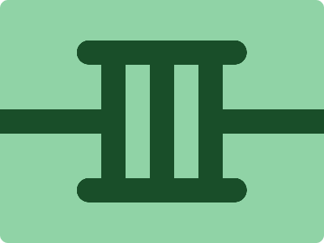

# CSS Battle Daily Targets: 2/4/2024

### Daily Targets to Solve

  
[see the daily target](https://cssbattle.dev/play/Eql7SI0qY2o1EnTSZpSe)  
Check out the solution video on [YouTube](https://www.youtube.com/watch?v=CA6EHLcv5cE)

### Stats

**Match**: 100%  
**Score**: 649.14{220}

### Code

```html
<p><p a>
<style>
 *{
   background:#90D3A6
 }
  p{
    background:#194E29;
    color:#194E29;
    height:30;
    width:210;
    border-radius:50q;
    margin:50 87;
    box-shadow:0 180q,170q 90q,-170q 90q
  }
  [a]{
    rotate:90deg;
    width:190;
    margin:37;
    box-shadow:0-63q,0-127q
  }
</style>
```

### Code Explanation

- **Background (`body`):** The `body` background color is set to a light green shade (`#90D3A6`), providing a soft and refreshing backdrop for the shapes.

- **Shapes (`p`, `[a]`):** Two elements contribute to the design:
  - The `<p>` element represents a large circle. It has a dark green background color (`#194E29`) and a matching text color. The circle has a height of 30 pixels, a width of 210 pixels, and a border-radius of 50%. Three box shadows are applied to create the leaf-like shapes protruding from the circle, positioned at the top, right, and left.
  - The `[a]` attribute selector targets a smaller circle within the larger circle. It represents the hole in the leaf. It is rotated 90 degrees to appear on the left side of the larger circle. It has a width of 190 pixels, creating a smaller circle within the larger one. Two box shadows are applied to create the shadow effect for the hole.

- **Positioning and Layout (`margin`):** Both the `<p>` element and the `[a]` attribute selector are positioned with margins to control their placement within the container.

- **Styling (`background`, `color`, `box-shadow`, `rotate`):** Each element has specific styling applied to create the desired visual appearance. The box shadows applied to both elements create the leaf-like shapes and shadows for the hole. The rotation is applied to the `[a]` attribute selector to position it correctly within the larger circle.

Overall, the code creates a visually appealing composition with a leaf-like shape and a hole, achieving a perfect match and a high score.