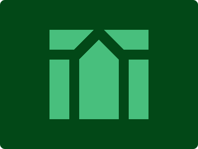

# CSS Battle Daily Targets: 3/4/2024

### Daily Targets to Solve

  
[see the daily target](https://cssbattle.dev/play/bQ6av6lIPOCXnRMHOmvO)  
Check out the solution video on [YouTube](https://www.youtube.com/watch?v=cOp_XAQk80o)

### Stats

**Match**: 100%  
**Score**: 634.21{258}

### Code

```html
<p><i>
<style>
 *{
   background:#024817;
   >*{
     background:#48BF7D
   }
   +*{
     margin:60 100
   }
 }
  p,i{
    position:absolute;
  }
  p{
    height:120;
    width:40;
    border:solid 20px#024817;
    margin:40 0 0-20;
    -webkit-box-reflect:right 80px
  }
  i{
    width:20;
    height:80;
    background:#024817;
    rotate:45deg;
    margin:-70 65
  }
</style>
```

### Code Explanation

- **Background (`body`):** The `body` background color is set to a dark green shade (`#024817`), providing a natural and earthy backdrop for the shapes.

- **Shapes (`*`, `>*`, `+*`):** Three elements contribute to the design:
  - The `*` selector targets all elements on the page. In this case, it selects the first square shape with a light green background color (`#48BF7D`). This square represents the stem of the leaf.
  - The `>*` selector targets all direct children elements of the page. In this case, it selects the second square shape with the same light green background color (`#48BF7D`). This square represents the main body of the leaf.
  - The `+*` selector targets all elements immediately following the second square shape. In this case, it selects the third square shape. This square serves as the shadow of the leaf.

- **Positioning and Layout (`position`, `margin`):** Both square shapes are positioned absolutely within the container, allowing precise control over their placement. The third square shape is given margins to position it relative to the second square, creating the shadow effect.

- **Styling (`background`, `border`, `box-shadow`, `rotate`):** Each element has specific styling applied to create the desired visual appearance. The second square shape (`>*`) represents the main body of the leaf and is styled to resemble a leaf shape using borders. The first square shape (`*`) represents the stem of the leaf. The third square shape (`+*`) represents the shadow of the leaf and has box shadows applied to create the shadow effect.

Overall, the code creates a visually appealing composition with a leaf-like shape and a shadow, achieving a perfect match and a high score.