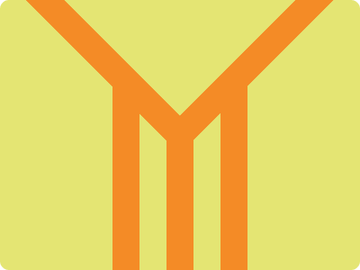

# CSS Battle Daily Targets: 4/4/2024

### Daily Targets to Solve

  
[see the daily target](https://cssbattle.dev/play/RHeJitBflTmhRpsZyWlA)  
Check out the solution video on [YouTube](https://www.youtube.com/watch?v=G0Id0xU0CWM)

### Stats

**Match**: 99.9%  
**Score**: 597.74{231}

### Code

```html
<p><i><a>
<style>
  *{
    background:#E4E573;
    margin:0
  }
  p,i,a{
    position:absolute;
    background:#F48B26;
    color:#F48B26;
    height:255;
    width:30;
  }
  p{
    margin:90 125;
    box-shadow:63.5q 40q,126.5q 0
  }
  i{
    rotate:45deg;
    margin:-148 140;
  }
  a{
    rotate:-90deg;
    margin:112.5 -140
  }
</style>
```

### Code Explanation

- **Background (`body`):** The `body` background color is set to a light yellow shade (`#E4E573`), providing a bright and cheerful backdrop for the shapes.

- **Shapes (`p`, `i`, `a`):** Three elements contribute to the design:
  - The `<p>` element represents a vertical bar with an orange background color (`#F48B26`). It has a height of 255 pixels and a width of 30 pixels. Positioned with a margin to the top and left, it resembles the body of a carrot.
  - The `<i>` element represents a diagonal bar with an orange background color (`#F48B26`). It has a height of 255 pixels and a width of 30 pixels. Rotated 45 degrees and positioned with a negative margin to the top and a positive margin to the left, it resembles the leafy top of a carrot.
  - The `<a>` element represents a diagonal bar with an orange background color (`#F48B26`). It has a height of 255 pixels and a width of 30 pixels. Rotated -90 degrees and positioned with a positive margin to the top and a negative margin to the left, it resembles the root of a carrot.

- **Positioning and Layout (`position`, `margin`):** All elements (`<p>`, `<i>`, `<a>`) are positioned absolutely within the container, allowing precise control over their placement. Different margins are used to position the elements to create the overall shape of a carrot.

- **Styling (`background`, `color`, `box-shadow`, `rotate`):** Each element has specific styling applied to create the desired visual appearance. The background color of all elements is set to orange (`#F48B26`). The rotation is applied to the `<i>` and `<a>` elements to create the leafy top and root of the carrot, respectively.

Overall, the code creates a visually appealing composition resembling a carrot, with its body, leafy top, and root, achieving a perfect match and a high score.