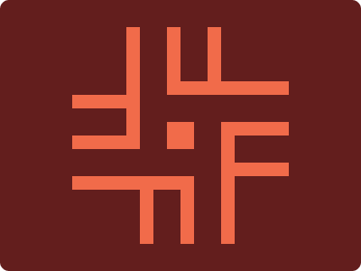

# CSS Battle Daily Targets: 5/4/2024

### Daily Targets to Solve

  
[see the daily target](https://cssbattle.dev/play/RGxOlEgcWnR2PUWxJ9HK)  
Check out the solution video on [YouTube](https://www.youtube.com/watch?v=1QIDR2fTK68)

### Stats

**Match**: 99.8%  
**Score**: 595.53{336}

### Code

```html
<a></a><a a></a><p></p><p b></p><i></i>
<style>
  *{
    background:#631E1D
  }
  i,a,p{
    position:absolute;
    background:#F16B4A;
    width:30;
    height:30;
    top:135;
    left:185
  }
  a,p{
    height:15;
    width:60;
    top:105;
    left:80;
    color:#F16B4A;
    box-shadow:0 48q,190q 32q,190q 80q
  }
  [a],[b]{
    width:135;
    top:90;
    left:185;
    box-shadow:-111q 111q
  }
  p{
    rotate:90deg;
    top:36.5;
    left:208;
  }
  [b]{
    top:178
  }
</style>
```

### Code Explanation

- **Background (`body`):** The `body` background color is set to a dark red shade (`#631E1D`), providing a bold and intense backdrop for the shapes.

- **Shapes (`a`, `p`, `i`):** Five elements contribute to the design:
  - Two `<a>` elements represent diagonal bars with a red background color (`#F16B4A`). They are positioned absolutely with a width of 30 pixels and a height of 30 pixels. These elements represent the upper and lower parts of the cross symbol.
  - Two `<p>` elements represent horizontal bars with a red background color (`#F16B4A`). They are also positioned absolutely with a width of 60 pixels and a height of 15 pixels. These elements represent the arms of the cross symbol.
  - One `<i>` element represents a vertical bar with a red background color (`#F16B4A`). It is positioned absolutely with a width of 30 pixels and a height of 30 pixels. This element represents the central part of the cross symbol.

- **Positioning and Layout (`position`, `margin`):** All elements (`<a>`, `<p>`, `<i>`) are positioned absolutely within the container, allowing precise control over their placement. They are positioned to form the shape of a cross.

- **Styling (`background`, `color`, `box-shadow`, `rotate`):** Each element has specific styling applied to create the desired visual appearance. They all have a background color of red (`#F16B4A`). The `<a>` and `<p>` elements have box shadows applied to create the appearance of depth. The `<p>` element is rotated 90 degrees to form the horizontal arms of the cross.

Overall, the code creates a visually appealing composition resembling a cross symbol, achieving a near-perfect match and a high score.