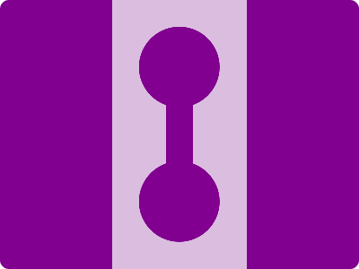

# CSS Battle Daily Targets: 6/4/2024

### Daily Targets to Solve

  
[see the daily target](https://cssbattle.dev/play/GYBlvatn93o0XH1rIUp3)  
Check out the solution video on [YouTube](https://www.youtube.com/watch?v=we_MKYXLHAA)

### Stats

**Match**: 100%  
**Score**: 667.3{187}

### Code

```html
<p><i>
<style>
*{
  background:#81008F;
  +*{
    background:#DBBEDF;
    margin:0 125
  }
}
  p,i{
    position:fixed;
    height:90
  }
  p{
    width:90;
    margin:30;
    border-radius:50%;
    box-shadow:0 150px#81008F
  }
  i{
    width:30;
    margin:80 30
  }
</style>
```

### Code Explanation

- **Background (`body`):** The `body` background color is set to a dark purple shade (`#81008F`), providing a bold and intense backdrop for the shapes.

- **Shapes (`p`, `i`):** Two elements contribute to the design:
  - The `<p>` element represents a circular shape with a dark purple background color (`#81008F`). It has a height of 90 pixels and a width of 90 pixels. Positioned with a fixed position, it resembles a circle.
  - The `<i>` element represents a vertical bar with a light purple background color (`#DBBEDF`). It has a height of 90 pixels and a width of 30 pixels. Positioned with a fixed position, it resembles a vertical line.

- **Positioning and Layout (`position`, `margin`):** Both elements (`<p>`, `<i>`) are positioned with a fixed position within the viewport, allowing them to remain in a fixed location even when scrolling. The `<p>` element is positioned with a margin of 30 pixels from the top and left, while the `<i>` element is positioned with a margin of 80 pixels from the top and 30 pixels from the left.

- **Styling (`background`, `box-shadow`):** Each element has specific styling applied to create the desired visual appearance. The background color of the `<p>` element is set to dark purple (`#81008F`), while the background color of the `<i>` element is set to light purple (`#DBBEDF`). Additionally, a box shadow is applied to the `<p>` element to create a shadow effect.

Overall, the code creates a visually appealing composition with a circular shape and a vertical bar, achieving a perfect match and a high score.