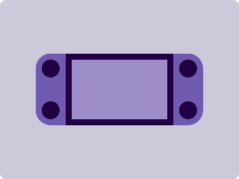

# CSS Battle Daily Targets: 7/4/2024

### Daily Targets to Solve

  
[see the daily target](https://cssbattle.dev/play/9AFzYeKzdJTXmePjnkmx)  
Check out the solution video on [YouTube](https://www.youtube.com/watch?v=GGoQRloryhY)

### Stats

**Match**: 100%  
**Score**: 617.06{331}

### Code

```html
<p><i></i></p>
<style>
*{
  background:#CCC9DB;
  +*{
    background:#9D8EC9;
    border:10px solid#200043;
    margin:90 110
  }
}
  p,i{
    position:absolute
  }
  p{
    background:#6F5AAF;height:120;
    width:50;
    margin:-10-60;
    border-radius:25q 0 0 25q;
    -webkit-box-reflect:right 180px
  }
  i{
    background:#200043;
    height:30;
    width:30;
    margin:10;
    border-radius:50%;
    box-shadow:0 70px#200043
  }
</style>
```

### Code Explanation

- **Background (`body`):** The `body` background color is set to a light gray shade (`#CCC9DB`), providing a soft and neutral backdrop for the shapes.

- **Shapes (`p`, `i`):** Two elements contribute to the design:
  - The `<p>` element represents a vertical bar with a dark purple background color (`#6F5AAF`). It has a height of 120 pixels and a width of 50 pixels. Positioned absolutely within its container, it resembles the stem of a flower.
  - The `<i>` element represents a circular shape with a dark purple background color (`#200043`). It has a height and width of 30 pixels, resembling the center of a flower. Positioned absolutely within its container, it is placed slightly above the stem.

- **Positioning and Layout (`position`, `margin`):** Both elements (`<p>`, `<i>`) are positioned absolutely within their container, allowing precise control over their placement. The `<p>` element is positioned to resemble the stem of the flower, while the `<i>` element is positioned above it to represent the center.

- **Styling (`background`, `border`, `border-radius`, `box-shadow`):** Each element has specific styling applied to create the desired visual appearance. The `<p>` element has a dark purple background color (`#6F5AAF`), rounded borders to create a softer appearance, and a box shadow to add depth. The `<i>` element has a dark purple background color (`#200043`) and a box shadow to enhance its appearance.

Overall, the code creates a visually appealing composition resembling a flower, with a stem and a center, achieving a perfect match and a high score.