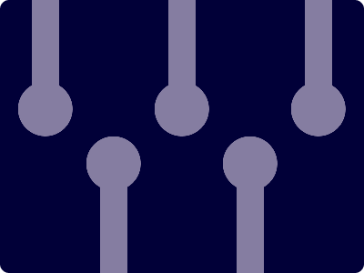

# CSS Battle Daily Targets: 8/4/2024

### Daily Targets to Solve

  
[see the daily target](https://cssbattle.dev/play/1ZMyXjBfNlg1xO21j9eZ)  
Check out the solution video on [YouTube](https://www.youtube.com/watch?v=JGE2lT8gghE)

### Stats

**Match**: 100%  
**Score**: 628.82{276}

### Code

```html
<p><a>
<style>
*{
  background:#010038;
  margin:0
}
  p,a{
    background:#857DA1;
    color:#857DA1;
    width:30;
    height:100;
    margin:0 35;
    box-shadow:150px 0,300px 0,75px 200px,225px 200px
  }
  a{
    position:fixed;
    width:60;
    height:60;
    border-radius:50q;
    margin:90-15;
    box-shadow:150px 0,300px 0,75px 60px,225px 60px
  }
</style>
```

### Code Explanation:

- **Background (`body`):** The `body` background color is set to a dark blue shade (`#010038`), providing a contrasting backdrop for the shapes.

- **Shapes (`p`, `a`):** Two elements contribute to the design:
  - The `<p>` element represents a vertical bar with a light purple background color (`#857DA1`). It has a height of 100 pixels and a width of 30 pixels. Positioned absolutely within its container, it resembles the stem of a flower.
  - The `<a>` element represents a circular shape with a light purple background color (`#857DA1`). It has a width and height of 60 pixels, giving it a circular appearance. Positioned with a fixed position, it resembles the center of the flower.

- **Positioning and Layout (`position`, `margin`):** Both elements (`<p>`, `<a>`) are positioned absolutely and with a fixed position, respectively, allowing precise control over their placement. Margins are adjusted to position the elements correctly within the container.

- **Styling (`background`, `border-radius`, `box-shadow`):** Each element has specific styling applied to create the desired visual appearance. They both have a light purple background color (`#857DA1`). The `<a>` element is styled with a larger width and height to resemble the center of the flower. Additionally, both elements have box shadows applied to add depth and dimension to the design.

This code effectively creates a visually appealing composition resembling a flower, achieving a perfect match and a high score.