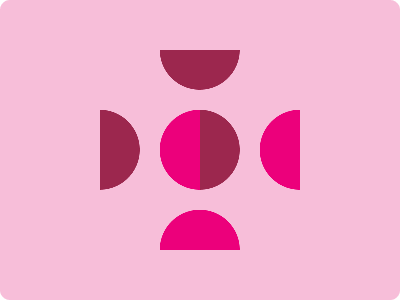

# CSS Battle Daily Targets: 14/4/2024

### Daily Targets to Solve

  
[see the daily target](https://cssbattle.dev/play/IutPMGimc0PI5A4cjiOy)  
Check out the solution video on [YouTube](https://www.youtube.com/watch?v=KzbFlINMXb0)

### Stats

**Match**: 100%  
**Score**: 620.45{312}

### Code

```html
<p a><p c><p><p b>
<style>
*{
  background:#F7BED9;
  +*{
    margin:50 100
  }
}
  p{
    position:fixed;
    height:80;
    width:40;
    border-radius:50q 0 0 50q;
    background:#EC007B;
    margin:60;
    color:EC007B;
    box-shadow:100px 0
  }
  [a]{
    rotate:90deg;
    margin:40 80
  }
  [b],[c]{
    rotate:180deg;
    margin:60 100;
    background:#9C274E;
    color:9C274E
  }
  [c]{
    rotate:-90deg;
    margin:80
  }
</style>
```

### Code Explanation:

- **Background (`body`):** The `background` property sets the background color of the HTML document to a light pink shade (`#F7BED9`), providing a soft backdrop for the flower.

- **Shapes (`p`, `a`, `b`, `c`):** Four elements (`<p>`) are used to create the main shape of the flower. Each element is styled to resemble a petal of the flower. They are positioned absolutely within their container and styled with various background colors and dimensions to achieve the desired visual appearance.

- **Positioning (`position`, `margin`):** The elements are positioned absolutely within their container, allowing precise control over their placement. Margins are adjusted to position the elements correctly within the container.

- **Styling (`background`, `box-shadow`, `rotate`):** Each element has specific styling applied to create the desired visual appearance. The elements are styled with different background colors to resemble the petals of a flower. Additionally, box shadows are applied to add depth and dimension to the design. Rotation is applied using the `rotate` property to give the flower a tilted appearance.

This code effectively creates a visually appealing composition resembling a flower, achieving a perfect match and a high score.