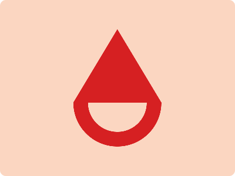

# CSS Battle Daily Targets: 26/4/2024

### Daily Targets to Solve

  
[see the daily target](https://cssbattle.dev/play/MjspbN9bLWsAQlJYGgsx)  
Check out the solution video on [YouTube](https://www.youtube.com/watch?v=s6G5gTZaLmo)

### Stats

**Match**: 100%  
**Score**: 636.22{252}

### Code

```html
<p></p><a>
<style>
  *{
    background:#FBD6C1;
    position:fixed
  }
  p{
    background:#D62022;
    height:125;
    width:150;
    margin:42 117;
    clip-path:polygon(50%0,0%100%,100%100%)
  }
  a{
    height:50;
    width:100;
    border:25px solid#D62022;
    border-radius:0 0 100q 100q;
    border-top:0;
    margin:167 117
  }
</style>
```

### Code Explanation:

- **Background Color (`background`):** The background color of the HTML document is set to `#FBD6C1`, which is a light pink shade.

- **Shapes (`*`):** All elements within the document have a background color of `#FBD6C1`, matching the background color of the document.

- **Positioning (`position: fixed`):** All elements are positioned as fixed elements to ensure they stay in a fixed position within the viewport.

- **Styling (`border-radius`, `clip-path`, `border`):** 
  - The `<p>` element represents the petals of the flower. It is styled with a specific height, width, background color, and a clip-path to create a triangular shape resembling a petal. The clip-path polygon is defined to create the triangular shape with rounded corners.
  
  - The `<a>` element represents the center of the flower. It is styled with a specific height, width, and a border to create a circular shape resembling the center of the flower. The border properties are adjusted to create a curved edge at the bottom of the element.

This code effectively creates a visually appealing composition resembling a flower, with careful positioning and styling of elements.