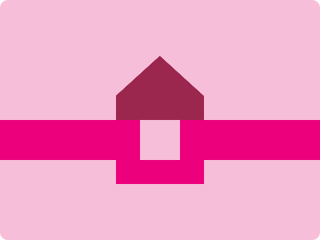

# CSS Battle Daily Targets: 5/05/2024

### Daily Targets to Solve

  
[see the daily target](https://cssbattle.dev/play/gdDH5DSU9viQU5PFhVNy)  
Check out the solution video on [YouTube](https://www.youtube.com/watch?v=JGugLq4I-woE)

### Stats

**Match**: 100%  
**Score**: 628.82{276}

### Code

```html
<p><a><i>
<style>
*{
  background:#F7BED9
}
  p,a,i{
    position:fixed
  }
  p{
    height:50;
    width:410;
    background:#EC007B;
    margin:142-10
  }
  a{
    padding:25;
    border:30px solid#EC007B;
    margin:-30 147
  }
  i{
    height:80;
    width:110;
    background:#9C274E;
    margin:-105-55;
    clip-path:polygon(50%0,0%62%,0%100%,100%100%,100%62%)
  }
</style>
```

### Code Explanation:

- **Background Color (`background`):** The background color of the HTML document is set to `#F7BED9`, which is a shade of pink.

- **Shapes (`*`):** All elements within the document have a white background color (`#fff`), providing a contrast against the background color.

- **Positioning (`position: fixed`):** 
  - The `<p>` element represents the stem of the flower. It is styled with a fixed position, specific height, width, background color, margin, and clip-path to create a triangular shape resembling a stem.

  - The `<a>` element represents the central circular element of the flower. It is styled with a fixed position, specific padding, border, margin, and background color to create a circular shape with a border.

  - The `<i>` element represents the petals of the flower. It is styled with a fixed position, specific height, width, background color, margin, and clip-path to create a petal shape using a polygon clip-path.

This code effectively creates a visually appealing composition resembling a flower, with careful use of CSS properties to position, style, and clip elements.