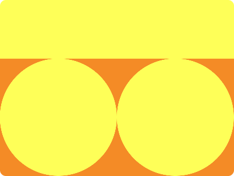

# CSS Battle Daily Targets: 8/05/2024

### Daily Targets to Solve

  
[see the daily target](https://cssbattle.dev/play/0gAh1NOCyXjYd1ICIiaB)  
Check out the solution video on [YouTube](https://www.youtube.com/watch?v=3I6TrFZrgz4)

### Stats

**Match**: 100%  
**Score**: 702.36{143}

### Code

```html
<style>
*{
  background:linear-gradient(#FEFF58 25%,#F48B26 0);
  +*{
    background:#FEFF58;
    margin:100 200 0 0;
    border-radius:50%;
    box-shadow:200px 0#FEFF58
  }
}
</style>
```

### Code Explanation:

- **Background Color (`background`):** The background color of the HTML document is set using a linear gradient. It starts with `#FEFF58` at 25% and transitions to `#F48B26` at 0%, creating a gradient effect from yellow to orange.

- **Shapes (`*`):** All elements within the document have a solid background color of `#FEFF58`, which is a shade of yellow. Additionally, each element has a margin set to create space between them. They also have a border-radius property set to 50% to create circular shapes. A box-shadow is applied to the second set of elements to create a shadow effect, giving the appearance of depth.

This code effectively creates a visually appealing composition resembling a flower, with careful use of CSS properties to style and position elements.