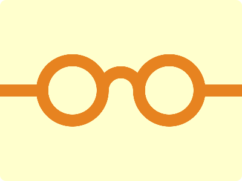

# CSS Battle Daily Targets: 12/05/2024

### Daily Targets to Solve

  
[see the daily target](https://cssbattle.dev/play/VB4QD1knFQGsiA8TWmQm)  
Check out the solution video on [YouTube](https://www.youtube.com/watch?v=fttacS6xPqA)

### Stats

**Match**: 100%  
**Score**: 625.95{287}

### Code

```html
<a></a><p><p a>
<style>
 *{
   background:#FFFFCD;
   +*{
     background:#E78320;
     margin:140 0
   }
 }
  a,p{
    position:fixed;
    border:20px solid#E78320;
    border-radius:50%
  }
  a{
    padding:20;
    border-color:#E78320#FFFFCD#FFFFCD#E78320;
    rotate:45deg;
    margin:-30 160
  }
  p{
    background:#FFFFCD;
    padding:40;
    margin:-50 60
  }
  [a]{
    margin:-50 220
  }
</style>
```

### Code Explanation:

- **Background Color (`background`):** The background color of the HTML document is set to `#FFFFCD`, a light yellow shade.

- **Shapes (`*`):** All elements inherit a background color of `#E78320`, which is an orange shade. They also have a margin set to create space between them.

- **Positioning (`position: fixed`):** 
  - Both the `<a>` and `<p>` elements are positioned as fixed elements.
  - The `<a>` element represents the center of the flower. It has a padding, border color combination that creates a triangular shape, and it's rotated by 45 degrees. The margin is adjusted to position it properly.
  - The `<p>` element represents the petals of the flower. It has a background color of `#FFFFCD`, padding, and margin to create the petal shape. The `[a]` selector further adjusts the margin for one of the petals.

Overall, the code effectively creates a visually appealing flower composition using CSS properties for styling and positioning elements.