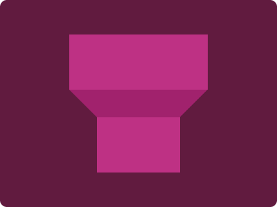

# CSS Battle Daily Targets: 14/05/2024

### Daily Targets to Solve

  
[see the daily target](https://cssbattle.dev/play/0cRjR9sR0cXY8KBOn7eL)  
Check out the solution video on [YouTube](https://www.youtube.com/watch?v=R1WJ0EriSDU)

### Stats

**Match**: 100%  
**Score**: 669.25{184}

### Code

```html
<style>
  * {
    background: #611b3f;
    + * {
      background: linear-gradient(#be3184 40%, #a1226d 40% 60%, #be3184 60%);
      margin: 50 100;
      clip-path: polygon(
        0% 40%,
        0% 0,
        100% 0,
        100% 40%,
        80% 60%,
        80% 100%,
        20% 100%,
        20% 60%
      );
    }
  }
</style>
```

### Code Explanation

- **Global Background (`*`)**:
  ```css
  * {
    background: #611b3f;
  }
  ```
  - This sets the background color of the entire document to a dark maroon shade (`#611b3f`).

- **Sibling Selector (`+ *`)**:
  ```css
  + * {
    background: linear-gradient(#be3184 40%, #a1226d 40% 60%, #be3184 60%);
    margin: 50 100;
    clip-path: polygon(
      0% 40%,
      0% 0,
      100% 0,
      100% 40%,
      80% 60%,
      80% 100%,
      20% 100%,
      20% 60%
    );
  }
  ```
  - **Background**: Applies a linear gradient background to elements that follow another element. The gradient transitions as follows:
    - `#be3184` for the first 40%
    - `#a1226d` from 40% to 60%
    - `#be3184` from 60% to 100%
  - **Margin**: Sets a margin of `50px` on the top and bottom, and `100px` on the left and right to position the element properly.
  - **Clip-path**: Uses the `polygon` function to clip the element into a specific shape with the following coordinates:
    - `0% 40%`: Starts at the left edge, 40% from the top.
    - `0% 0`: Moves to the top-left corner.
    - `100% 0`: Moves to the top-right corner.
    - `100% 40%`: Moves to 40% from the top, on the right edge.
    - `80% 60%`: Moves to 60% from the top, 80% from the left.
    - `80% 100%`: Moves to the bottom, 80% from the left.
    - `20% 100%`: Moves to the bottom, 20% from the left.
    - `20% 60%`: Moves to 60% from the top, 20% from the left.

The combined CSS creates a dark maroon background with a specific clipped shape featuring a gradient that appears when one element follows another.