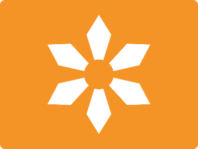

# CSS Battle Daily Targets: 17/05/2024

### Daily Targets to Solve

  
[see the daily target](https://cssbattle.dev/play/g1q8n7Mpa93WGLBVgTV7)  
Check out the solution video on [YouTube](https://www.youtube.com/watch?v=nVMnPYBBUcI)

### Stats

**Match**: 100%  
**Score**: 630.8{269}

### Code

```html
<p></p>
<p a></p>
<p b></p>
<a>
<style>
  * {
    background: #f59426;
  }
  p,
  a {
    position: fixed;
  }
  p {
    background: #fff;
    padding: 120+25;
    margin: 22 167;
    clip-path: polygon(
      0% 17%,
      50% 0,
      100% 17%,
      50% 50%,
      100% 83%,
      50% 100%,
      0% 83%,
      50% 50%
    );
  }
  [a] {
    rotate: 60deg;
  }
  [b] {
    rotate: 120deg;
  }
  a {
    padding: 30;
    border-radius: 50%;
    margin: 112 162;
  }
</style>
```

### Code Explanation

- **Global Background (`*`)**:
  - Sets the background color of all elements to `#f59426`, an orange shade.

- **Positioning (`p, a`)**:
  - Both `<p>` and `<a>` elements are positioned as fixed elements, ensuring they stay in a fixed position within the viewport.

- **Styles for `<p>` Tag (`p`)**:
  - Sets the background color to `#fff`, white.
  - Applies padding of `145px` (120 + 25).
  - Sets a margin of `22px` top and bottom, `167px` left and right.
  - Uses the `clip-path` property to create a custom polygon shape with specific coordinates:
    - `0% 17%`: Starts at the left edge, 17% from the top.
    - `50% 0`: Moves to the top-center.
    - `100% 17%`: Moves to 17% from the top, on the right edge.
    - `50% 50%`: Moves to the center.
    - `100% 83%`: Moves to 83% from the top, on the right edge.
    - `50% 100%`: Moves to the bottom-center.
    - `0% 83%`: Moves to 83% from the top, on the left edge.
    - `50% 50%`: Moves back to the center.

- **Rotation for Custom Attributes (`[a]` and `[b]`)**:
  - `[a]`: Rotates the element with attribute `a` by `60deg`.
  - `[b]`: Rotates the element with attribute `b` by `120deg`.

- **Styles for `<a>` Tag (`a`)**:
  - Applies padding of `30px`.
  - Adds a border-radius of `50%` to create a circular shape.
  - Sets a margin of `112px` top and bottom, `162px` left and right.