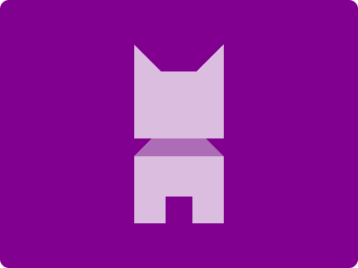

# CSS Battle Daily Targets: 18/05/2024

### Daily Targets to Solve

  
[see the daily target](https://cssbattle.dev/play/BQMnbQNtp6vzXoBRhTHU)  
Check out the solution video on [YouTube](https://www.youtube.com/watch?v=49o7cqd6GJU)

### Stats

**Match**: 100%  
**Score**: 635.54{254}

### Code

```html
<style>
  * {
    background: #81008f;
    + * {
      margin: 50 150;
      background: linear-gradient(#dbbedf 52.5%, #ad6cb6 0 62.5%, #dbbedf 0);
      clip-path: polygon(
        30% 15%,
        70% 15%,
        100% 0,
        100% 52.5%,
        80% 52.5%,
        100% 62.5%,
        100% 100%,
        65% 100%,
        65% 85%,
        35% 85%,
        35% 100%,
        0% 100%,
        0% 62.5%,
        20% 52.5%,
        0% 52.5%,
        0% 0
      );
    }
  }
</style>
```

### Code Explanation

- **Global Background (`*`)**:

  - Sets the background color of all elements to `#81008F`, a deep purple shade.

- **Sibling Selector (`+*`)**:
  - Applies styles to any element that follows another element:
    - **Margin**: Sets a margin of `50px` on the top and bottom, and `150px` on the left and right to position the element.
    - **Background**: Uses a linear gradient background with the following specifications:
      - `#DBBEDF` (a light purple shade) for the first 52.5%.
      - `#AD6CB6` (a medium purple shade) from 52.5% to 62.5%.
      - `#DBBEDF` again from 62.5% to 100%.
    - **Clip-path**: Uses the `polygon` function to clip the element into a specific shape with the following coordinates:
      - `30% 15%`: Starts at 30% from the left and 15% from the top.
      - `70% 15%`: Moves to 70% from the left and 15% from the top.
      - `100% 0`: Moves to the top-right corner.
      - `100% 52.5%`: Moves to 52.5% from the top, on the right edge.
      - `80% 52.5%`: Moves to 52.5% from the top, 80% from the left.
      - `100% 62.5%`: Moves to 62.5% from the top, on the right edge.
      - `100% 100%`: Moves to the bottom-right corner.
      - `65% 100%`: Moves to the bottom, 65% from the left.
      - `65% 85%`: Moves to 85% from the top, 65% from the left.
      - `35% 85%`: Moves to 85% from the top, 35% from the left.
      - `35% 100%`: Moves to the bottom, 35% from the left.
      - `0% 100%`: Moves to the bottom-left corner.
      - `0% 62.5%`: Moves to 62.5% from the top, on the left edge.
      - `20% 52.5%`: Moves to 52.5% from the top, 20% from the left.
      - `0% 52.5%`: Moves to 52.5% from the top, on the left edge.
      - `0% 0`: Moves back to the top-left corner.

This setup creates a uniquely shaped and positioned element with a gradient background following the initial background color of deep purple.
