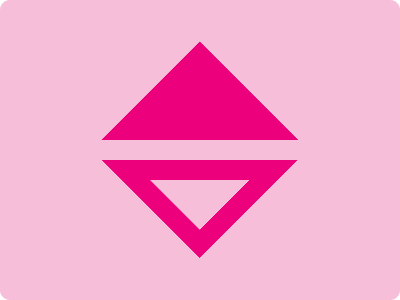

# CSS Battle Daily Targets: 19/05/2024

### Daily Targets to Solve

  
[see the daily target](https://cssbattle.dev/play/95CZPF9dNnPJEmt6sUbJ)  
Check out the solution video on [YouTube](https://www.youtube.com/watch?v=kBPomsNAYDQ)

### Stats

**Match**: 100%  
**Score**: 655.09{208}

### Code

```html
<p><p a><p b>
<style>
*{
  background:#F7BED9
}
  p{
    background:#EC007B;
    height:98;
    margin:42 94;
    clip-path:polygon(50%0,0%100%,100%100%)
  }
  [a],[b]{
    rotate:180deg;
    margin:-22 94
  }
  [b]{
    height:50;
    margin:-78 142;
    background:#F7BED9
  }
</style>
```

### Code Explanation

- **Global Background (`*`)**:
  - Sets the background color of all elements to `#F7BED9`, a light pink shade.

- **Styles for `<p>` Tag (`p`)**:
  - **Background**: Sets the background color to `#EC007B`, a bright pink.
  - **Height**: Sets the height to `98px`.
  - **Margin**: Sets the margin to `42px` top and bottom, `94px` left and right.
  - **Clip-path**: Uses the `polygon` function to create a triangular shape with the following coordinates:
    - `50% 0`: Top center.
    - `0% 100%`: Bottom left corner.
    - `100% 100%`: Bottom right corner.

- **Styles for Custom Attributes `[a]` and `[b]`**:
  - **Rotation (`rotate: 180deg`)**:
    - Rotates the elements with the attributes `[a]` and `[b]` by `180 degrees`.
  - **Margin**:
    - Sets the margin to `-22px` top and bottom, `94px` left and right for both `[a]` and `[b]`.

- **Additional Styles for `[b]`**:
  - **Height**: Sets the height to `50px`.
  - **Margin**: Sets the margin to `-78px` top and bottom, `142px` left and right.
  - **Background**: Sets the background color to `#F7BED9`, matching the global background color.

This setup creates three `<p>` elements, two of which are rotated and repositioned to form a visually appealing, symmetric pattern with varying colors and sizes.