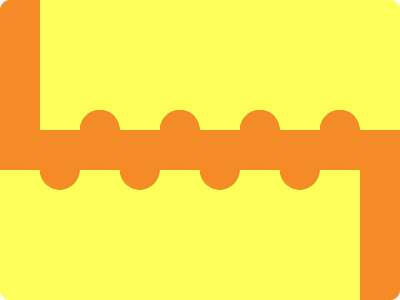

# CSS Battle Daily Targets: 22/05/2024

### Daily Targets to Solve

  
[see the daily target](https://cssbattle.dev/play/99IQiyaZW72dCMvXvdV4)  
Check out the solution video on [YouTube](https://www.youtube.com/watch?v=Q_26v-gg73Y)

### Stats

**Match**: 100%  
**Score**: 636.92{250}

### Code

```html
<p>
<style>
*{
  background:#F48B26;
  +*{
    background:#FEFF58;
    margin:-10 0 170 40;
    box-shadow:-40px 180px#FEFF58
  }
}
  p{
    padding:20;
    position:fixed;
    border-radius:50%;
    margin:120;
    color:F48B26;
    box-shadow:-80px 0,80px 0,160px 0,-120px 40px,-40px 40px,40px 40px,120px 40px
  }
</style>
```

### Code Explanation

- **Global Background (`*`)**:
  - Sets the background color of all elements to `#F48B26`, an orange shade.

- **Sibling Selector (`+*`)**:
  - Applies styles to any element that follows another element:
    - **Background**: Sets the background color to `#FEFF58`, a bright yellow.
    - **Margin**: Applies a margin of `-10px` top, `0` right, `170px` bottom, and `40px` left to position the element relative to the preceding one.
    - **Box-shadow**: Adds a shadow with `-40px` horizontal offset, `180px` vertical offset, and color `#FEFF58`, creating a shadow effect below and to the left of the element.

- **Styles for `<p>` Tag (`p`)**:
  - **Padding**: Adds `20px` of padding to the element.
  - **Position**: Sets the position to `fixed`, so the element stays in a fixed location relative to the viewport.
  - **Border-radius**: Sets the border-radius to `50%`, making the element circular.
  - **Margin**: Applies a margin of `120px` on all sides to position the circle within the layout.
  - **Color**: Sets the text color to `#F48B26`, matching the global background color.
  - **Box-shadow**: Adds multiple shadows to create the desired layout with specific offsets:
    - `-80px 0`: A shadow to the left.
    - `80px 0`: A shadow to the right.
    - `160px 0`: A further shadow to the right.
    - `-120px 40px`: A shadow to the left and slightly below.
    - `-40px 40px`: A shadow slightly to the left and below.
    - `40px 40px`: A shadow slightly to the right and below.
    - `120px 40px`: A shadow to the right and slightly below.

This setup creates a fixed-position circular element with multiple shadow effects to achieve a visually appealing design with the specified color scheme and positioning.