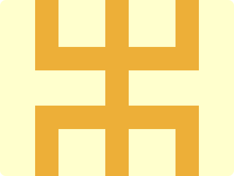

# CSS Battle Daily Targets: 26/05/2024

### Daily Targets to Solve

  
[see the daily target](https://cssbattle.dev/play/h1lqgh64LtcWHU5Huofy)  
Check out the solution video on [YouTube](https://www.youtube.com/watch?v=f_p30nWC-Mo)

### Stats

**Match**: 100%  
**Score**: 678.39{171}

### Code

```html
<p>
<style>
*{
  background:#FFFFCD;
  +*{
    border:40px solid#EDAF38;
    margin:-40 60 180;
    -webkit-box-reflect:below 60px
  }
}
  p{
    position:fixed;
    background:#EDAF38;
    padding:160+20;
    margin:0 80
  }
</style>
```

### Code Explanation

- **Global Styles (`*`)**:
  - **Background Color**: Sets the background color of the entire page to `#FFFFCD`, a light yellow.

- **Sibling Selector (`+*`)**:
  - **Border**: Applies a border of `40px solid #EDAF38` (a golden yellow color) to elements that follow another element.
  - **Margin**: Sets a margin of `-40px` top, `60px` right, and `180px` bottom to the sibling elements, positioning them relative to the preceding element.
  - **Reflection Effect (`-webkit-box-reflect`)**: Adds a reflection effect below the element with a `60px` gap.

- **Styles for `<p>` Tag (`p`)**:
  - **Position**: Sets the position to `fixed`, keeping the element in a fixed location relative to the viewport.
  - **Background**: Sets the background color to `#EDAF38`, the same golden yellow as the sibling border color.
  - **Padding**: Adds `180px` (`160 + 20`) of padding, increasing the size of the element.
  - **Margin**: Applies a margin of `0` top and bottom, and `80px` left and right to position the element within the layout.

This CSS setup creates a fixed-position element (`<p>`) with a specific size and background color. The sibling elements that follow the `<p>` tag receive a golden yellow border, margin adjustments, and a reflection effect, achieving the desired visual layout.