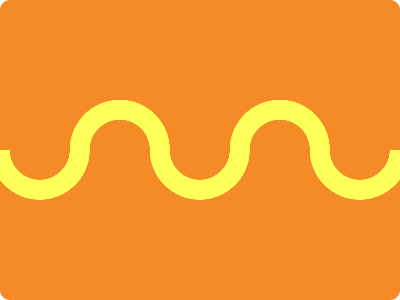

# CSS Battle Daily Targets: 28/05/2024

### Daily Targets to Solve

  
[see the daily target](https://cssbattle.dev/play/GWCcGIiZCG2XZUUVCZmH)  
Check out the solution video on [YouTube](https://www.youtube.com/watch?v=lbi-sHOummY)

### Stats

**Match**: 100%  
**Score**: 643.83{232}

### Code

```html
<p><a><b><c><d>
<style>
*{
  background:#F48B26
}
  p,a,b,c,d{
    position:fixed;
    padding:15+30;
    border:20px solid#FEFF58;
    border-radius:50px 50px 0 0;
    margin:92 62;
    border-bottom:0;
  }
  a{
    margin:-35 110
  }
  b{
    rotate:180deg;
    margin:15 -290
  }
  c,d{
    margin:-35 -210
  }
</style>
```

### Code Explanation

- **Global Styles (`*`)**:
  - **Background Color**: Sets the background color of the entire page to `#F48B26`, an orange shade.

- **Common Styles for `<p>`, `<a>`, `<b>`, `<c>`, and `<d>` Tags**:
  - **Position**: All elements are positioned using `fixed`, meaning they are placed relative to the viewport and stay in a fixed position when scrolling.
  - **Padding**: Adds `45px` (`15 + 30`) of padding to each element, increasing their size.
  - **Border**: Applies a `20px` solid border of `#FEFF58` (a bright yellow) to each element.
  - **Border-radius**: Sets the border-radius to `50px 50px 0 0`, creating rounded top-left and top-right corners, making a half-circle on top.
  - **Margin**: Applies a margin of `92px` top and bottom, `62px` left and right to position the elements within the layout.
  - **Border-bottom**: Removes the bottom border by setting it to `0`.

- **Specific Styles for `<a>` Tag (`a`)**:
  - **Margin**: Adjusts the margin to `-35px` top and bottom, and `110px` left and right to reposition the element.

- **Specific Styles for `<b>` Tag (`b`)**:
  - **Rotate**: Rotates the element by `180 degrees`, flipping it upside down.
  - **Margin**: Adjusts the margin to `15px` top and bottom, and `-290px` left and right to reposition the element.

- **Specific Styles for `<c>` and `<d>` Tags (`c`, `d`)**:
  - **Margin**: Adjusts the margin to `-35px` top and bottom, and `-210px` left and right to reposition the elements.

This CSS setup creates multiple fixed-position elements with specific sizes, borders, and rounded corners. The individual margins and rotations ensure that each element is precisely positioned to match the desired visual layout, creating a layered and visually interesting design.