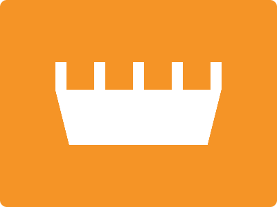

# CSS Battle Daily Targets: 30/05/2024

### Daily Targets to Solve

  
[see the daily target](https://cssbattle.dev/play/0pXO9nG5qNDgiarJaIpU)  
Check out the solution video on [YouTube](https://www.youtube.com/watch?v=ELUqudwLwfo)

### Stats

**Match**: 100%  
**Score**: 654.57{209}

### Code

```html
<p>
<style>
*{
  background:#F59426;
  +*{
    background:#FFF;
    margin:90 80;
    clip-path:polygon(100%0,100%32%,91.5%100%,8%100%,0%34%,0%0)
  }
}
  p{
    position:fixed;
    padding:20;
    margin:0 16;
    color:F59426;
    box-shadow:56px 0,112px 0,168px 0
  }
</style>
```

### Code Explanation 

- **Global Styles (`*`)**:
  - **Background Color**: Sets the background color of the entire page to `#F59426`, an orange shade.

- **Styles for Sibling Elements (`+*`)**:
  - **Background Color**: Sets the background color of elements that follow another element to `#FFF` (white).
  - **Margin**: Applies a margin of `90px` top and bottom, `80px` left and right to position these elements.
  - **Clip-path**: Uses the `polygon` function to create a custom shape. The coordinates of the polygon create a six-sided figure:
    - `100% 0`: Top-right corner.
    - `100% 32%`: Right side, 32% from the top.
    - `91.5% 100%`: Bottom-right, slightly inward.
    - `8% 100%`: Bottom-left, slightly inward.
    - `0% 34%`: Left side, 34% from the top.
    - `0% 0`: Top-left corner.

- **Styles for `<p>` Tag (`p`)**:
  - **Position**: Sets the position to `fixed`, keeping the element in a fixed location relative to the viewport.
  - **Padding**: Adds `20px` of padding to increase the size of the element.
  - **Margin**: Applies a margin of `0` top and bottom, `16px` left and right to position the element within the layout.
  - **Color**: Sets the text color to `#F59426`, matching the global background color