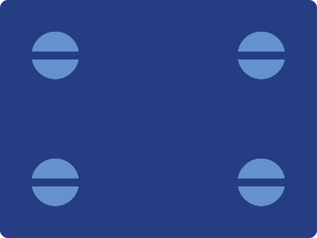

# CSS Battle Daily Targets: 06/06/2024

### Daily Targets to Solve

  
[see the daily target](https://cssbattle.dev/play/cY2DIn3yLxSML7LIHL0D)  
Check out the solution video on [YouTube](https://www.youtube.com/watch?v=QelHJQNWZDg)

### Stats

**Match**: 100%  
**Score**: 653.03{212}

### Code

```html
<p>
<style>
*{
  background:#243D83;
  +*{
    background:#6592CF;
    border-radius:50%;
    margin:40 300 200 40;
    color:6592CF;
    box-shadow:260px 0,0 160px,260px 160px
  }
}
  p{
    position:fixed;
    padding:5+400;
    box-shadow:0 160px#243D83;
    margin:25 0
  }
</style>
```

### Code Explanation

- **Global Styles (`*`)**:
  - **Background Color**: Sets the background color of the entire page to `#243D83`, a deep blue.

- **Styles for Sibling Elements (`+*`)**:
  - **Background Color**: Sets the background color of sibling elements to `#6592CF`, a lighter blue.
  - **Border-radius**: Applies a border radius of `50%` to create a circular shape.
  - **Margin**: Positions the elements with `40px` top, `300px` right, `200px` bottom, and `40px` left margins.
  - **Color**: Sets the text color to `#6592CF`, the same as the background color of the sibling elements.
  - **Box-shadow**: Adds shadows to the elements:
    - `260px 0`: A shadow 260 pixels to the right.
    - `0 160px`: A shadow 160 pixels below.
    - `260px 160px`: A shadow 260 pixels to the right and 160 pixels below.

- **Styles for `<p>` Tag (`p`)**:
  - **Position**: Sets the position to `fixed`, keeping the element in a fixed location relative to the viewport.
  - **Padding**: Adds `5px` of padding and `400px` to increase the size of the element.
  - **Box-shadow**: Adds a shadow `0 160px` with the color `#243D83`, creating a shadow 160 pixels below the element.
  - **Margin**: Applies a margin of `25px` top and bottom, `0` left and right to position the element within the layout.

This setup creates a main element with a deep blue background. The sibling elements have a lighter blue background, are circular due to the border radius, and are positioned using specific margins. The box shadows create additional visual elements around the primary shapes, matching the target image's design.