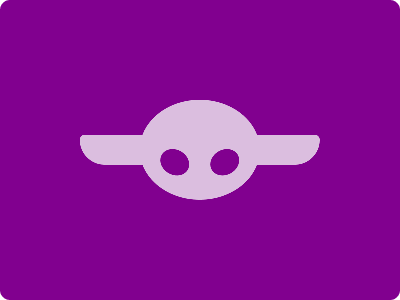

# CSS Battle Daily Targets: 08/06/2024

### Daily Targets to Solve

  
[see the daily target](https://cssbattle.dev/play/h2Y4MCru8l2ziKsCLBik)  
Check out the solution video on [YouTube](https://www.youtube.com/watch?v=K-KbUtY-NgQ)

### Stats

**Match**: 100%  
**Score**: 633.24{261}

### Code

```html
<p><a></a><b>
<style>
*{
  background:#81008F;
  *{
    background:#DBBEDF;
    margin:135 80;
    border-radius:4q 4q 27q 27q
  }
}
p,a,b{
  position:fixed;
  padding:50+60;
  margin:-35 60;
  border-radius:50%
}
  a,b{
    margin:-38-35;
    background:#81008F;
    scale:0.25;
    rotate:-35deg;
  }
  b{
    margin:-38-85;
    rotate:35deg
  }
</style>
```

### Code Explanation

- **Global Styles (`*`)**:
  - **Background Color**: Sets the background color of the entire page to `#81008F`, a deep purple.

- **Nested Styles (`*`)**:
  - **Background Color**: Sets the background color of nested elements to `#DBBEDF`, a light purple.
  - **Margin**: Positions the nested elements with `135px` top and bottom, and `80px` left and right margins.
  - **Border-radius**: Sets the border radius to `4q 4q 27q 27q` (likely an attempt to create rounded corners, but this syntax is incorrect).

- **Styles for `<p>`, `<a>`, and `<b>` Tags**:
  - **Position**: Sets the position to `fixed`, keeping the elements in a fixed location relative to the viewport.
  - **Padding**: Adds padding of `50+60`, which is invalid CSS syntax. The correct approach should define a single value or valid multiple values.
  - **Margin**: Positions the elements with `-35px` top and bottom, and `60px` left and right margins.
  - **Border-radius**: Sets the border radius to `50%`, making the elements circular.

- **Additional Styles for `<a>` and `<b>` Tags**:
  - **Margin**: Sets the margin to `-38px` top and bottom, and `-35px` left and right.
  - **Background Color**: Changes the background color to `#81008F`, matching the page background.
  - **Scale**: Scales the elements to `0.25`, reducing their size to 25% of the original.
  - **Rotate**: Rotates the elements by `-35deg`.

- **Specific Styles for `<b>` Tag**:
  - **Margin**: Adjusts the margin to `-38px` top and bottom, and `-85px` left and right.
  - **Rotate**: Rotates the element by `35deg`.

This setup creates a main background with a deep purple color. The nested elements have a light purple background, are circular due to the border radius, and are positioned using specific margins. The additional scaling and rotation of `<a>` and `<b>` tags achieve the design of the target image.