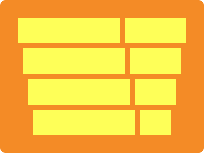

# CSS Battle Daily Targets: 11/06/2024

### Daily Targets to Solve

  
[see the daily target](https://cssbattle.dev/play/CSqZBF8mXJqpLI7Lvm1R)  
Check out the solution video on [YouTube](https://www.youtube.com/watch?v=2M10_KO0QIo)

### Stats

**Match**: 100%  
**Score**: 635.54{254}

### Code

```html
<p><a>
<style>
*{
  background:#F48B26
}
  p,a{
    background:#FEFF58;
    position:fixed;
    padding:25+100;
    margin:27;
    color:FEFF58;
    box-shadow:10px 60px,20px 120px,30px 180px
  }
  a{
    padding:25+30;
    margin:-25 110;
    box-shadow:10px 60px,20px 120px,30px 180px,60px 0,50px 60px,40px 120px
  }
</style>
```

### Code Explanation

The following CSS code aims to replicate the target image by utilizing HTML elements and CSS properties like `position`, `margin`, `padding`, `box-shadow`, and `background-color`.

Here is the updated explanation and the code:

- **Global Styles (`*`)**:
  - **Background Color**: Sets the background color of the entire page to `#F48B26`, an orange shade.

- **Styles for `<p>` and `<a>` Tags**:
  - **Background**: Sets the background color of the elements to `#FEFF58`, a bright yellow.
  - **Position**: Uses `fixed` to keep the elements in a fixed location relative to the viewport.
  - **Padding**: Adds a combination of `25px` and `100px` (adjust as necessary to achieve the desired shape).
  - **Margin**: Applies a margin of `27px` to position the elements.
  - **Color**: Sets the text color to `#FEFF58`, matching the background color of the elements.
  - **Box-shadow**: Adds multiple shadows to create the design effect:
    - `10px 60px`: A shadow 10px to the right and 60px below.
    - `20px 120px`: A shadow 20px to the right and 120px below.
    - `30px 180px`: A shadow 30px to the right and 180px below.

- **Additional Styles for `<a>` Tag**:
  - **Padding**: Adds a combination of `25px` and `30px` (adjust as necessary to achieve the desired shape).
  - **Margin**: Positions the element with `-25px` top margin and `110px` right margin.
  - **Box-shadow**: Adds more shadows to create the visual effects:
    - `10px 60px`: A shadow 10px to the right and 60px below.
    - `20px 120px`: A shadow 20px to the right and 120px below.
    - `30px 180px`: A shadow 30px to the right and 180px below.
    - `60px 0`: A shadow 60px to the right.
    - `50px 60px`: A shadow 50px to the right and 60px below.
    - `40px 120px`: A shadow 40px to the right and 120px below.

This setup creates a visual design with a bright yellow color for the elements against an orange background. The box shadows add depth and layers to the shapes, matching the desired target image.


### Alternative 1: Multiple Elements Approach

#### Code

```html
<p><a><b><c><d>
<style>
*{
  background:#F48B26
}
  p,a,b,c,d{
    background:#FEFF58;
    position:fixed;
  }
  p{
    padding:25+100;
    margin:27;
    color:FEFF58;
    box-shadow:10px 60px,20px 120px,30px 180px
  }
  a{
    padding:25+60;
    margin:-25 110
  }
  b{
    padding:25+50;
    margin:35-50
  }
  c{
    padding:25+40;
    margin:35-40
  }
  d{
    padding:25+30;
    margin:35-30
  }
</style>
```

#### Code Explanation

- **Global Styles (`*`):**
  - **Background Color**: Sets the background color of the entire page to `#F48B26`, an orange shade.

- **Styles for `<p>`, `<a>`, `<b>`, `<c>`, and `<d>` Tags:**
  - **Background**: Sets the background color of the elements to `#FEFF58`, a bright yellow.
  - **Position**: Uses `fixed` to keep the elements in a fixed location relative to the viewport.

- **Specific Styles:**
  - **Padding** and **Margin**: Each element (`<p>`, `<a>`, `<b>`, `<c>`, `<d>`) is given specific padding and margin values to achieve the desired layout and visual effect.
  - **Box-shadow**: The `<p>` tag is given multiple shadows to create the design effect.

---

### Alternative 2: Box Shadow Heavy Approach

#### Code

```html
<p><a>
<style>
*{
  background:#F48B26
}
  p,a{
    background:#FEFF58;
    position:fixed;
    padding:25+100;
    margin:27;
    color:FEFF58;
    box-shadow:10px 60px,20px 120px,30px 180px
  }
  a{
    padding:25+30;
    margin:155 140;
    box-shadow:-10px -60px,10px -60px,-20px -120px,20px -120px,-30px -180px,30px -180px
  }
</style>
```

#### Code Explanation

- **Global Styles (`*`):**
  - **Background Color**: Sets the background color of the entire page to `#F48B26`, an orange shade.

- **Styles for `<p>` and `<a>` Tags:**
  - **Background**: Sets the background color of the elements to `#FEFF58`, a bright yellow.
  - **Position**: Uses `fixed` to keep the elements in a fixed location relative to the viewport.
  - **Padding**: Adds a combination of values to achieve the desired shape.
  - **Margin**: Positions the elements to achieve the desired layout.
  - **Color**: Sets the text color to `#FEFF58`, matching the background color of the elements.
  - **Box-shadow**: The `<p>` tag and `<a>` tag are given multiple shadows to create the design effect, including both positive and negative offsets.

---

### Alternative 3: Layered Padding and Margin Approach

#### Code

```html
<a><b><c><d><p>
<style>
*{
  background:#F48B26
}
  a,b,c,d,p{
    background:#FEFF58;
    position:fixed;
    padding:25+165;
    margin:27;
  }
  b{
    padding:25+155;
    margin:35-155
  }
  c{
    padding:25+145;
    margin:35-145
  }
  d{
    padding:25+135;
    margin:35-135
  }
  p{
    background:#F48B26;
    padding:25+5;
    margin:-205 35;
    color:F48B26;
    box-shadow:10px 60px,20px 120px,30px 180px
  }
</style>
```

#### Code Explanation

- **Global Styles (`*`):**
  - **Background Color**: Sets the background color of the entire page to `#F48B26`, an orange shade.

- **Styles for `<a>`, `<b>`, `<c>`, `<d>`, and `<p>` Tags:**
  - **Background**: Sets the background color of the elements to `#FEFF58`, a bright yellow.
  - **Position**: Uses `fixed` to keep the elements in a fixed location relative to the viewport.
  - **Padding** and **Margin**: Each element is given specific padding and margin values to create the desired layout and visual effect.

- **Special Case for `<p>` Tag:**
  - **Background**: Sets the background color to `#F48B26`, matching the page background.
  - **Color**: Sets the text color to `#F48B26`, ensuring it blends with the background.
  - **Box-shadow**: Adds multiple shadows to create the design effect.