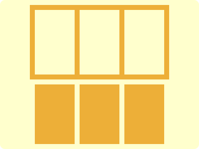

# CSS Battle Daily Targets: 16/06/2024

### Daily Targets to Solve

  
[see the daily target](https://cssbattle.dev/play/tzkXNQ95ZRmS2q9shIeW)  
Check out the solution video on [YouTube](https://www.youtube.com/watch?v=wpun5HL73OQ)

### Stats

**Match**: 100%  
**Score**: 651.54{215}

### Code

```html
<p><a>
<style>
*{
  background:#FFFFCD;
  +*{
    background:#EDAF38;
    margin:10 60 140
  }
}
  p,a{
    padding:65+40;
    position:fixed;
    margin:10;
    color:FFFFCD;
    box-shadow:90px 0,180px 0
  }
  a{
    padding:60+40;
    background:#EDAF38;
    margin:85-40;
    color:EDAF38
  }
</style>
```

### Code Explanation

- **Global Styles (`*`)**:
  - **Background Color**: Sets the background color of the entire page to `#FFFFCD`, a pale yellow shade.
  - **Nested Styles (`+*`)**:
    - **Background Color**: Sets the background color of sibling elements to `#EDAF38`, a golden yellow shade.
    - **Margin**: Positions the sibling elements with `10px` top margin, `60px` left margin, and `140px` bottom margin.

- **Styles for `<p>` and `<a>` Tags**:
  - **Padding**: Adds a combination of `65px` and `40px` padding to `<p>` and `60px` and `40px` padding to `<a>`, controlling their sizes.
  - **Position**: Uses `fixed` to keep the elements in a fixed location relative to the viewport.
  - **Margin**: Applies `10px` margin to position the elements.
  - **Color**: Sets the text color to `#FFFFCD`, matching the background color of the global elements.
  - **Box-shadow**: Adds shadows to create the design effect:
    - `90px 0`: A shadow `90px` to the right.
    - `180px 0`: A shadow `180px` to the right.

- **Additional Styles for `<a>` Tag**:
  - **Background**: Sets the background color to `#EDAF38`, matching the nested elements.
  - **Margin**: Positions the element with `85px` top margin and `-40px` left margin.
  - **Color**: Sets the text color to `#EDAF38`, matching the background color of the nested elements.

This setup creates a visual design with pale yellow and golden yellow elements, positioned and sized to match the desired target image. The box shadows add depth and layers to the shapes, creating the visual effect.