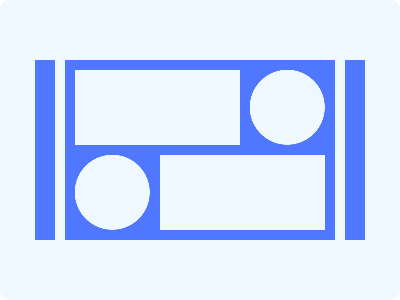

# CSS Battle Daily Targets: 17/06/2024

### Daily Targets to Solve

  
[see the daily target](https://cssbattle.dev/play/9dPRS195Gt3O8uAzgNWj)  
Check out the solution video on [YouTube](https://www.youtube.com/watch?v=4G_0A6P8XSQ)

### Stats

**Match**: 100%  
**Score**: 629.37{274}

### Code

```html
<p><a><b>
<style>
* {
  background: #EFF8FE;
  margin: 0;
}
p, a, b {
  position: absolute;
  top: 50%;
  left: 50%;
  transform: translate(-50%, -50%);
  background: #4F77FF;
}
p {
  width: 140px;
  height: 140px;
  border-radius: 50%;
}
a {
  width: 75px;
  height: 75px;
  border-radius: 50%;
  transform: translate(-110px, -110px);
}
b {
  width: 75px;
  height: 75px;
  border-radius: 50%;
  transform: translate(35px, 35px);
}
</style>
```

### Code Explanation

- **Global Styles (`*`)**:
  - **Background Color**: Sets the background color of the entire page to `#EFF8FE`, a very light blue shade.
  - **Margin**: Removes the default margin for all elements.

- **Styles for `<p>`, `<a>`, and `<b>` Tags**:
  - **Position**: Uses `absolute` to position the elements relative to the nearest positioned ancestor (in this case, the `<body>`).
  - **Top and Left**: Sets the position to `50%` from the top and left to center the elements.
  - **Transform**: Uses `translate(-50%, -50%)` to accurately center the elements both horizontally and vertically.
  - **Background**: Sets the background color to `#4F77FF`, a blue shade.
  - **Width and Height**: Sets the dimensions of each element.
  - **Border-radius**: Applies a border-radius of `50%` to make the elements circular.

- **Additional Styles for `<a>` and `<b>` Tags**:
  - **Width and Height**: Sets the dimensions of the `<a>` and `<b>` elements to `75px`.
  - **Transform**: Uses `translate` to position the `<a>` and `<b>` elements relative to the `<p>` element.
    - `<a>`: `translate(-110px, -110px)` moves the element `110px` to the left and `110px` up from the center.
    - `<b>`: `translate(35px, 35px)` moves the element `35px` to the right and `35px` down from the center.

This setup creates a visual design with a light blue background and blue circular elements, positioned and sized to match the desired target image. The use of absolute positioning and transformations ensures that the elements are accurately placed in the required positions.